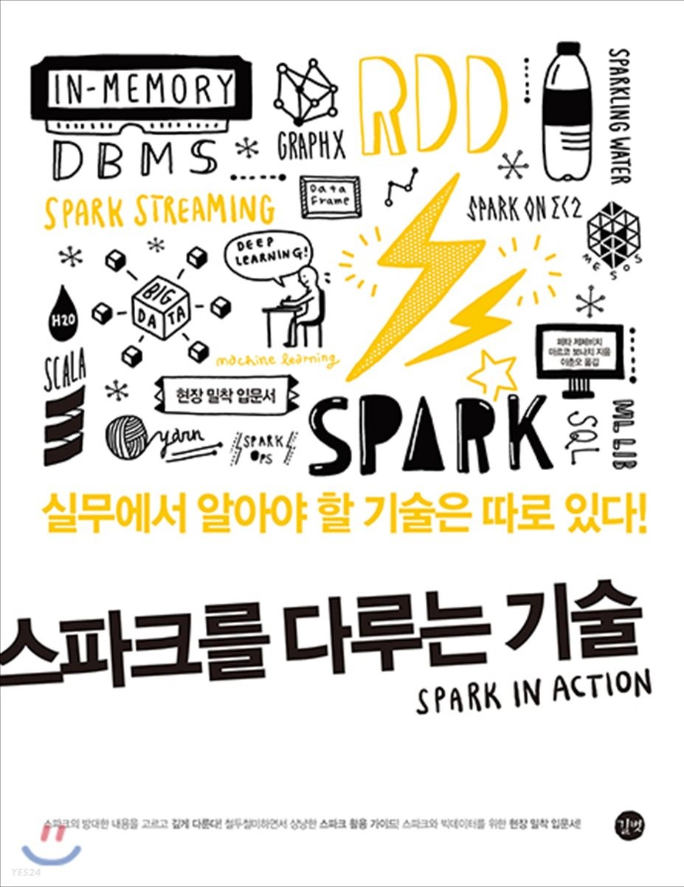

# Spark in Action
스파크를 다루는 기술 SPARK IN ACTION 스터디

`21.09.12`~`21.12.19` 스터디는 매주 일요일 20시!

## ground rule
- 모더레이터가 발표 준비
- 청강자는 스터디 당 최소 1회 질문 실시

## schedule

#### [1장 아파치 스파크 소개](https://github.com/jinmang2/spark-in-action/blob/main/ch01_introduce_apache_spark.md)
- `21.09.12`
- 발표자: [나영윤](https://github.com/fightnyy)님

#### [2장 스파크의 기초](https://github.com/jinmang2/spark-in-action/blob/main/ch02_spark_basic.md)
- `21.09.26`
- 발표자: [모윤호](https://github.com/momozzing)님

#### [3장 스파크 애플리케이션 작성하기](https://github.com/jinmang2/spark-in-action/blob/main/ch03_spark_application.md)
- `21.10.03`
- 발표자: [진명훈](https://github.com/jinmang2)님

#### 4장 스파크 API 깊이 파헤치기
- `21.10.10`
- 발표자: [나영윤](https://github.com/fightnyy)님

#### 5장 스파크 SQL로 멋진 쿼리를 실행하자
- `21.10.17`
- 발표자: [진호](https://github.com/Jake1152)님

#### 6장 스파크 스트리밍으로 데이터를 흐르게 하자
- `21.10.24`
- 발표자: [진명훈](https://github.com/jinmang2)님

#### 7장 MLlib로 더 똑똑해지자
- `21.10.31`
- 발표자: [모윤호](https://github.com/momozzing)님

#### 8장 스파크 ML로 만드는 분류와 군집화
- `21.11.07`
- 발표자: [진호](https://github.com/Jake1152)님

#### 9장 점을 연결하는 GraphX
- `21.11.14`
- 발표자: [손재만](https://github.com/woaksths)님

#### 10장 스파크 클러스터 구동
- `21.11.21`
- 발표자: [나영윤](https://github.com/fightnyy)님

#### 11장 스파크 자체 클러스터
- `21.11.28`
- 발표자: [모윤호](https://github.com/momozzing)님

#### 12장 YARN 클러스터와 메소스 클러스터
- `21.12.05`
- 발표자: [손재만](https://github.com/woaksths)님

#### 13장 실용 예제: 실시간 대시보드를 구현하자
- `21.12.12`
- 발표자: [진호]()님

#### 14장 스파크와 H2O를 활용한 딥러닝
- `21.12.19`
- 발표자: [진명훈](https://github.com/jinmang2)님
