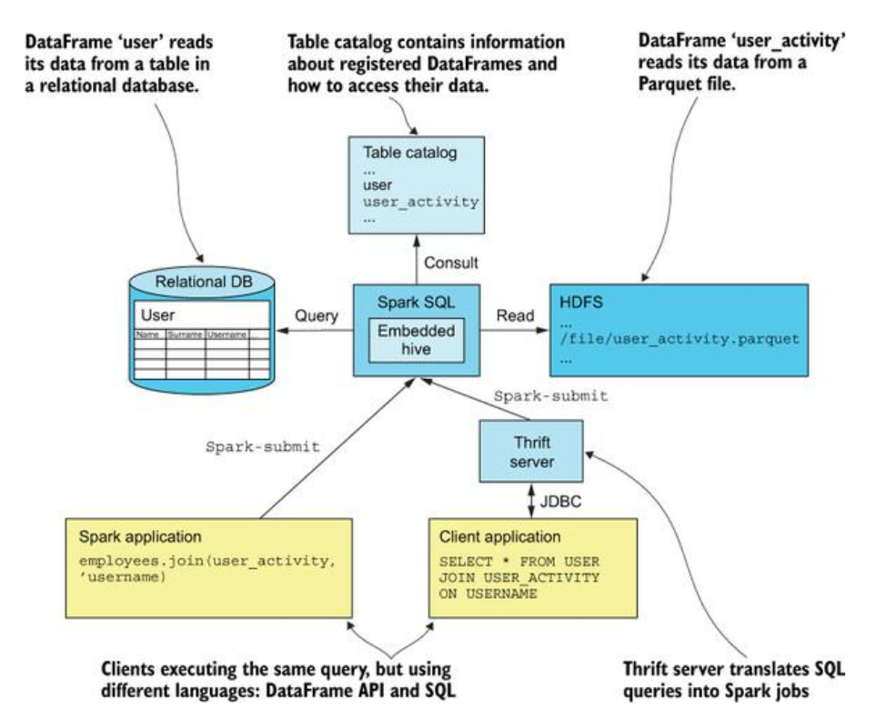
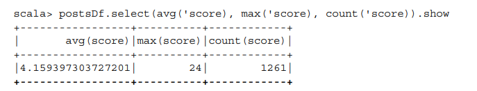

# ch5 Spark with SQL

## 살펴볼 주제

- DataFrame을 생성하는 방법
- DataFrame API사용법
- Dataset 소개
- SQL 쿼리 사용법
- 외부데이터를 로드 및 저장하는 방법
- 카탈리스트 최적화 엔진
- 텅스텐 프로젝트의 스파크 성능향상

# Intro

- DataFrame API를 세세히 다룬다.
- 5.1
    - RDD를 DataFrame으로 변환
    - DataFrame API를 사용 샘플데이터셋에 선택, 필터링, 정렬, 그루핑, 조인 연산 수행
    - DataFrame의 SQL함수 사용방법 및 DataFrame을 다시 RDD로 변환
- 5.2
    - Dataset 소개
- 5.3
    - SQL 쿼리로 DataFrame을 생성하는 방법
    - DataFrame 데이터에 SQL쿼리를 실행할 수 있는 방법 3가지
        - 스파크 프로그램
        - 스파크 SQL쉘
        - 스파크Thrift
- 5.4
    - 다양한 소스 외부 데이터를 로드 및 저장하는 방법
- 5.5
    - 스파크 SQL의 카탈리스트 최적화 엔진을 설명
- 5.6
    - 스파크 성능을 다방면으로 개선한 텅스텐 프로젝트 소개

# 5.1 DataFrame 다루기

---

- RDD 데이터를 직접 다룰수 있는 스파크하위 레벨 인터페이스이자 스파크 런타임의 핵심
- DataFrame API는 **칼럼이름 타입**이 저정된 테이블 형식의 **분산 정형 데이터**를 손쉽게 다룰 수 있는 상위 레벨 인터페이스를 제공
- **스파크 DataFrame 특징**
    - 분산처리를 염두에 둔 설계
    - 카탈리스트 엔진
        - 플러그인으로 제공
        - 확장 가능한 데이터 소스, 규칙, 데이터 타입을 바탕으로 리소스 사용량 실시간 최적화
    - SQL 및 도메인 특화 DSL
    - 작성된 표현식을 최적화된 하위레벨 RDD연산으로 변환
    - 정형데이터를 효과적으로 다룰 수 있는 방법 제공
    - DataFrame사용시
        - 칼럼 이름으로 데이터 참조
        - SQL쿼리를 통해 데이터에 접근
        - 다양한 소스의 데이터를 손쉽게 통합할수도 있도록 지원
    - **테이블 카탈로그**의 테이블로 등록 가능
        - **테이블 카탈로그**란?
            - 메타데이터들로 구성된 데이터베이스 내의 인스턴스**(DB에서의 개념)**
            - 데이터 자체를 저장하지 않는 대신 **정형 데이터로 접근하는 방법만 저장**(포인터 같은 것인가?)
    - RDD와 유사하며 RDD기반으로 동작하기에 4장의 RDD 원리가 유효
    - **모든 칼럼의 타입이 미리 지정되어 있어 RDD 비해 간경하고 손쉽게 쿼리 작성가능**
    
    
    

- DataFrame 생성 3가지
    1. 기존 RDD 변환
    2. SQL쿼리를 실행
    3. 외부데이터에서 로드
    

## 5.1.1 RDD에서 DataFrame 생성

---

- 데이터를 먼저 RDD로 로드한 후 DataFrame으로 변환하는 방법 가장 많이 사용
- ex) log file
    - 로그파일 DataFrame으로 가져오려면 먼저 파일을 RDD로 로드하여 줄을 파싱
    - 로그의 각 항목을 구성하는 하위 요소 파악
    - 위와 같은 정형과정을 거처야만 DataFrame으로 활용가능
    - 비정형 데이터→ RDD로 로드→RDD에서 DataFrame을 생성
- **RDD → DataFrame 생성 방법 3가지**
    1. row 데이터를 튜플로 저장한 RDD를 사용
        1. 간단하지만 스키마 속성을 전혀 지정할수없어서 제한적이다.
    2. case 클래스 사용
        1. case 클래스 작성이 조금더 복잡하지만 덜 제한적
    3. schema를 **명시적**으로 지정
        1. 스파크 표준처럼 널리 쓰임
    - 1,2 번 방법은 schema를 추론으로 지정한다.

### 5.1.1.1 SparkSession을 생성하고 암시적 메서드 임포트

---

- 스파크 DataFrame과 SQL 표현식 사용을 위해 SparkSession 객체 준비

```scala
import org.apache.spark.sql.SparkSession
val spark = SparkSession.builder().getOrCreate()
```

- **SparkSession**은 **SparkContexst와 SQLContext를 통합한 래퍼 클래스**이다.
- 스파크는 **RDD를 DataFram**e으로 **자동 변환**하는데 필요한 **암시적 스칼라 메서드**를 제공
    - **import spark.implicits_**
- SparkSeesion의 implict 객체는 Dataset Encoder가 정의된 책체로 구성한 RDD에 toDF라는 메서드를 추가한다.
- Encoder는 스파크 SQL 내부적으로 JVM 객체를 테이블 형식으로 변환하는데 사용하는 trait
    - [**trait**](https://wikidocs.net/26143)(위키독스 참조)
        - 트레잇(trait)은 자바의 인터페이스와 유사합니다. 메소드를 정의만 해놓을 수도 있고, 기본 구현을 할 수도 있습니다. 추상 클래스와 달리 생성자 파라미터는 가질 수 없습니다.
        - 트레잇에서는 가변 변수, 불변 변수 모두 선언 가능합니다. 트레잇을 구현하는 클래스에서 가변 변수는 수정이 가능하지만, 불변 변수는 수정할 수 없습니다

### 5.1.1.2 예제 데이터셋 로드 및 파악

---

- DataFrame API 실습으로 Stack Excahnge 데이터 사용
- intallianPosts.csv 필드 구성
    
    ■ **commentCoun**t—Number of comments related to the question/answer
    ■ **lastActivityDate**—Date and time of the last modification
    ■ **ownerUserId**—User ID of the owner
    ■ **body**—Textual contents of the question/answer
    ■ **score**—Total score based on upvotes and downvotes
    ■ **creationDate**—Date and time of creation
    ■ **viewCount**—View count
    ■ **title**—Title of the question
    ■ **tags**—Set of tags the question has been marked with
    ■ **answerCount**—Number of related answers
    ■ **acceptedAnswerId**—If a question contains the ID of its accepted answer
    ■ **postTypeId**—Type of the post; 1 is for questions, 2 for answers
    ■ **id**—Post’s unique ID
    

```scala
// Section 5.1.1

import spark.implicits._

val itPostsRows = sc.textFile("first-edition/ch05/italianPosts.csv")
val itPostsSplit = itPostsRows.map(x **=>** x.split("~"))
```

```python
from **__future__** import **print_function**

# Section 5.1.1

itPostsRows = sc.textFile("first-edition/ch05/italianPosts.csv")
itPostsSplit = itPostsRows.map(**lambda** x: x.split("~"))
```

- 데이터 파싱 및 RDD로 로드
- 마지막 줄은 RDD로 반환
    - itPostsRows.map(x **=>** x.split("~"))
    - toDF 메서드를 호출하면 문자열 배열 타입의 단일 칼럼을 가진 DataFrame을 얻을 수 있다.
    - 하지만 여기서 필요한 데이터와 거리가 있다.
    - **각 문자열을 각기 다른 칼럼으로 매핑**해야한다.

### 5.1.1.3 튜플 형식의 RDD에서 DataFrame 생성

---

- RDD의 배열을 튜플로 변환하고 **toDF**를 호출해서 **DataFrame**을 생성

```scala
val itPostsRDD = itPostsSplit.map(x => (x(0),x(1),x(2),x(3),x(4),x(5),x(6),x(7),x(8),x(9),x(10),x(11),x(12)))
val itPostsDFrame = itPostsRDD.toDF()
itPostsDFrame.show(10)

val itPostsDF = itPostsRDD.toDF("commentCount", "lastActivityDate", "ownerUserId", "body", "score", "creationDate", "viewCount", "title", "tags", "answerCount", "acceptedAnswerId", "postTypeId", "id")
**// 칼럼에 이름 전달하는 방식, 인자로 칼럼명을 넣어준다.

itPostsDF.printSchema
// 컬럼명 추가된 DataFrame확인하는 코드**
```

```python
itPostsRDD = itPostsSplit.map(lambda x: (x[0],x[1],x[2],x[3],x[4],x[5],x[6],x[7],x[8],x[9],x[10],x[11],x[12]))
itPostsDFrame = itPostsRDD.toDF()
**itPostsDFrame.show(10)

# +---+--------------------+---+--------------------+---+--------------------+----+--------------------+--------------------+----+----+---+----+
# | _1|                  _2| _3|                  _4| _5|                  _6|  _7|                  _8|                  _9| _10| _11|_12| _13|
# +---+--------------------+---+--------------------+---+--------------------+----+--------------------+--------------------+----+----+---+----+
# |  4|2013-11-11 18:21:...| 17|&lt;p&gt;The infi...| 23|2013-11-10 19:37:...|null|                    |                    |null|null|  2|1165|
# |  5|2013-11-10 20:31:...| 12|&lt;p&gt;Come cre...|  1|2013-11-10 19:44:...|  61|Cosa sapreste dir...| &lt;word-choice&gt;|   1|null|  1|1166|
# |  2|2013-11-10 20:31:...| 17|&lt;p&gt;Il verbo...|  5|2013-11-10 19:58:...|null|                    |                    |null|null|  2|1167|
# |  1|2014-07-25 13:15:...|154|&lt;p&gt;As part ...| 11|2013-11-10 22:03:...| 187|Ironic constructi...|&lt;english-compa...|   4|1170|  1|1168|
# |  0|2013-11-10 22:15:...| 70|&lt;p&gt;&lt;em&g...|  3|2013-11-10 22:15:...|null|                    |                    |null|null|  2|1169|
# |  2|2013-11-10 22:17:...| 17|&lt;p&gt;There's ...|  8|2013-11-10 22:17:...|null|                    |                    |null|null|  2|1170|
# |  1|2013-11-11 09:51:...| 63|&lt;p&gt;As other...|  3|2013-11-11 09:51:...|null|                    |                    |null|null|  2|1171|
# |  1|2013-11-12 23:57:...| 63|&lt;p&gt;The expr...|  1|2013-11-11 10:09:...|null|                    |                    |null|null|  2|1172|
# |  9|2014-01-05 11:13:...| 63|&lt;p&gt;When I w...|  5|2013-11-11 10:28:...| 122|Is &quot;scancell...|&lt;usage&gt;&lt;...|   3|1181|  1|1173|
# |  0|2013-11-11 10:58:...| 18|&lt;p&gt;Wow, wha...|  5|2013-11-11 10:58:...|null|                    |                    |null|null|  2|1174|
# +---+--------------------+---+--------------------+---+--------------------+----+--------------------+--------------------+----+----+---+----+
# only showing top 10 rows

itPostsDF = itPostsRDD.toDF(["commentCount", "lastActivityDate", "ownerUserId", "body", "score", "creationDate", "viewCount", "title", "tags", "answerCount", "acceptedAnswerId", "postTypeId", "id"])
# 칼럼에 이름 전달하는 방식, 인자로 칼럼명을 넣어준다.
itPostsDF.printSchema()
# root
#  |-- commentCount: string (nullable = true)
#  |-- lastActivityDate: string (nullable = true)
#  |-- ownerUserId: string (nullable = true)
#  |-- body: string (nullable = true)
#  |-- score: string (nullable = true)
#  |-- creationDate: string (nullable = true)
#  |-- viewCount: string (nullable = true)
#  |-- title: string (nullable = true)
#  |-- tags: string (nullable = true)
#  |-- answerCount: string (nullable = true)
#  |-- acceptedAnswerId: string (nullable = true)
#  |-- postTypeId: string (nullable = true)
#  |-- id: string (nullable = true)
```

### 5.1.1.4 케이스 클래스를 사용해 RDD를 DataFrame으로 변환

---

- **RDD**를 **DataFrame**으로 **변환**하는 **2번째 방법**
    - **RDD의 각 row를 case클래스로 매핑한 후 toDF메서드를 호출하는 것**
    - 변환에 앞서 RDD를 데이터를 저장할 **케이스 클래스 정의**
    - 데이터셋의 각 **row를 저장할 Post 클래스를 선언**

1. **step1**

```scala
//  변환에 앞서 RDD를 데이터를 저장할 **케이스 클래스 정의**
import java.sql.Timestamp
case class Post (commentCount:Option[Int], lastActivityDate:Option[java.sql.Timestamp],
  ownerUserId:Option[Long], body:String, score:Option[Int], creationDate:Option[java.sql.Timestamp],
  viewCount:Option[Int], title:String, tags:String, answerCount:Option[Int],
  acceptedAnswerId:Option[Long], postTypeId:Option[Long], id:Long)
```

```python
from pyspark.sql import Row
from datetime import datetime
def toIntSafe(inval):
  try:
    return int(inval)
  except ValueError:
    return None

def toTimeSafe(inval):
  try:
    return datetime.strptime(inval, "%Y-%m-%d %H:%M:%S.%f")
  except ValueError:
    return None

def toLongSafe(inval):
  try:
    return long(inval)
  except ValueError:
    return None

def stringToPost(row):
  r = row.encode('utf8').split("~")
  return Row(
    toIntSafe(r[0]),
    toTimeSafe(r[1]),
    toIntSafe(r[2]),
    r[3],
    toIntSafe(r[4]),
    toTimeSafe(r[5]),
    toIntSafe(r[6]),
    toIntSafe(r[7]),
    r[8],
    toIntSafe(r[9]),
    toLongSafe(r[10]),
    toLongSafe(r[11]),
    long(r[12]))
```

- Post 클래스 nullable 필드를 Option[T]타입으로 선언
- 이 필드에는 임의의 T타입 값을 가진 Some객체나 None 객체가 포함될수 있다.
- 타임스탬프 칼럼에는 java.sql.Timestamp 클래스를 사용할 수 있다.
- itPostRDD row를 Post객체로 매핑하기 전에 아래와 같이 implict 클래스를 정의하면 코드를 더 깔끔하게 작성 가능하다.

```scala
object StringImplicits {
   implicit class StringImprovements(val s: String) {
      import scala.util.control.Exception.catching
      def toIntSafe = catching(classOf[NumberFormatException]) opt s.toInt
      def toLongSafe = catching(classOf[NumberFormatException]) opt s.toLong
      def toTimestampSafe = catching(classOf[IllegalArgumentException]) opt Timestamp.valueOf(s)
   }
}
```

```python
from pyspark.sql import **Row**
from datetime import **datetime**
def **toIntSafe**(inval):
  try:
    return int(inval)
  except ValueError:
    return None

def toTimeSafe(inval):
  try:
    return datetime.strptime(inval, "%Y-%m-%d %H:%M:%S.%f")
  except ValueError:
    return None

def toLongSafe(inval):
  try:
    return long(inval)
  except ValueError:
    return None
```

- **StringImplicits 객체 내 implicit 클래스 선언된 StringImprovements는 3가지 Safe 메서드를 스칼라의 String 클래스에 implicit로 추가**
    - DataFrame 문자열 필드는 각 각 Integer, long, Timestamp 타입으로 안전하게 변환 가능
    - **안전한 변환**이란
        - **문자열 각 타입으로 변환할 수 없을때 예외 대신 None을 반환한다.**
    - **catching 함수**
        - 이 객체의 opt메서드는 사용자가 지정한 함수 결과를 Option 객체로 매핑한다.
        - Ooption 객체는 사용자가 cathcing 함수에 지정한 타입의 예외가 발생할경우 None을 반환하며, 그 외에는 Some 객체를 반환한다.

1. **step2**
    - implicit 클래스로 정의한 메서드 이용 row 파싱

```scala
import StringImplicits._
def **stringToPost**(row:String):Post = {
  val r = row.split("~")
  Post(r(0).toIntSafe,
    r(1).toTimestampSafe,
    r(2).toLongSafe,
    r(3),
    r(4).toIntSafe,
    r(5).toTimestampSafe,
    r(6).toIntSafe,
    r(7),
    r(8),
    r(9).toIntSafe,
    r(10).**toLongSafe**,
    r(11).toLongSafe,
    r(12).**toLong**)
}
val itPostsDFCase = itPostsRows.map(x => stringToPost(x)).toDF()
itPostsDFCase.printSchema
```

```python
def stringToPost(row):
  r = row.encode('utf8').split("~")
  return Row(
    toIntSafe(r[0]),
    toTimeSafe(r[1]),
    toIntSafe(r[2]),
    r[3],
    toIntSafe(r[4]),
    toTimeSafe(r[5]),
    toIntSafe(r[6]),
    toIntSafe(r[7]),
    r[8],
    toIntSafe(r[9]),
    toLongSafe(r[10]),
    toLongSafe(r[11]),
    long(r[12]))

rowRDD = itPostsRows.map(lambda x: stringToPost(x))
```

- 마지막 컬럼(id)에는 **null 값이 있을 수 없**으므로 **toLongSafe** 메서드 대신 **toLong**을 사용

### 5.1.1.5 스키마를 지정해 RDD를 DataFrame으로 변환

---

- RDD를 DataFrame으로 변환하는 마지막 방법
- **SparkSession의 createDataFrame 메서드를 사용하는 것**
    - **Row 타입의 객체를 포함하는 RDD**와 **StrucType 객체를 인자로 전달해 호출**할 수 있다.
    - **StructType**은 스파크 SQL의 **테이블 스키마를 표현**하는 **클래스**
    - StructType 객체는 테이블 칼럼을 표현하는 StructField객체를 한 개 또는 여러 개 가질 수 있다.

```scala
import org.apache.spark.sql.types._
val postSchema = StructType(Seq(
  StructField("commentCount", IntegerType, true),
  StructField("lastActivityDate", TimestampType, true),
  StructField("ownerUserId", LongType, true),
  StructField("body", StringType, true),
  StructField("score", IntegerType, true),
  StructField("creationDate", TimestampType, true),
  StructField("viewCount", IntegerType, true),
  StructField("title", StringType, true),
  StructField("tags", StringType, true),
  StructField("answerCount", IntegerType, true),
  StructField("acceptedAnswerId", LongType, true),
  StructField("postTypeId", LongType, true),
  StructField("id", LongType, false))
  )

**// Row 타입의 RDD와 DataFrame을 다음과 같이 생성**
**val rowRDD = itPostsRows.map(row => stringToRow(row))
val itPostsDFStruct = spark.createDataFrame(rowRDD, postSchema)**
itPostsDFStruct.**columns**
itPostsDFStruct.**dtypes**
```

```python
from pyspark.sql.types import *
postSchema = StructType([
  StructField("commentCount", IntegerType(), True),
  StructField("lastActivityDate", TimestampType(), True),
  StructField("ownerUserId", LongType(), True),
  StructField("body", StringType(), True),
  StructField("score", IntegerType(), True),
  StructField("creationDate", TimestampType(), True),
  StructField("viewCount", IntegerType(), True),
  StructField("title", StringType(), True),
  StructField("tags", StringType(), True),
  StructField("answerCount", IntegerType(), True),
  StructField("acceptedAnswerId", LongType(), True),
  StructField("postTypeId", LongType(), True),
  StructField("id", LongType(), False)
  ])

rowRDD = itPostsRows.map(lambda x: stringToPost(x))
itPostsDFStruct = sqlContext.createDataFrame(rowRDD, postSchema)
itPostsDFStruct.printSchema()
itPostsDFStruct.columns
itPostsDFStruct.dtypes
```

### 5.1.1.6 스키마 정보 가져오기

---

- printSchema 메서드 사용 서로 다른 방식으로 생성한 **itPostDFStruct**와 **itPostDFCase** 스키마가 동일한지 확인

```scala
itPostsDFCase.columns
itPostsDFStruct.dtypes
```

```python
itPostsDFCase.columns
itPostsDFStruct.dtypes
```

## 5.1.2 기본 DataFrame API

---

- **DataFrame DSL**
    - 관계형 데이터베이스의 일반 SQL 함수와 유사한 기능을 제공한다.
    - **DataFrame**은**RDD**와 마찬가지로 불변성, 지연 실행(lazy) 특징이 있다.
        - **즉 DataFrame은 데이터를 직접 변경하지 못한다.**
        - 반드시 새로운 DataFrame으로 변환해야한다.
        - 대부분의 DataFrame DSL함수는 결과를 바로 반환하지 않는대신
            - RDD 변환 연산자와 마찬가지로 새로운 DataFrame을 반환하면서 실제 연산은 **지연** 처리한다.
    

### 5.1.2.1 칼럼선택

---

- DataFrame DSL함수는 **Column 객체를 입력 받을 수** 있다.
- **특정 칼럼을 선택하는 select함수**는 **여러 칼럼 이름 또는 Column객체를 받고 이 칼럼만으로 구성된 새로운 DataFrame을 반환**한다.
- implicits 객체의 symbolToColumn 메서드는 스칼라의 Symbol 클래스를 Column으로 변환한다.
- 스칼라의 Symbol에는 interning개념이 적용되어있다.
    - interning
        - 객체의 인스턴스를 단 한개만 생성하는 기능
- 그렇기에 두 Symbol 객체의 동일 여부를 쉽게 검사 가능
- 암시적 메서드 **$**를 사용하여 **ColumnName객체로 변환**가능
    - ColumnName은 Column을 상속받은 클래스이므로 Column과 동일하게 사용가능
- **drop**
    - 컬럼 한개 제외한 **나머지 모든 컬럼 선택**
    - 컬럼 이름 또는 Column객체를 하나 받고 이  컬럼을 제외한 DataFrame을 반환

```scala
val postsDf = itPostsDFStruct
val postsIdBody = postsDf.select("id", "body")
// select함수는 여러 칼럼 이름 또는 Column객체를 받고 
// 이 칼럼만으로 구성된 새로운 DataFrame을 반환

val postsIdBody = postsDf.select(postsDf.col("id"), postsDf.col("body"))
// internining

// 아래 두 줄은 같은 결과 반환
val postsIdBody = postsDf.select(Symbol("id"), Symbol("body"))
val postsIdBody = postsDf.select('id, 'body)

val postsIdBody = postsDf.select($"id", $body")
// == val postsIdBody = postsDf.select('id, 'body)

val postIds = postsIdBody.drop("body")
// 컬럼 1개 제외하고 나머지 컬럼 반환
```

```python
postsDf = itPostsDFStruct
postsIdBody = postsDf.**select**("id", "body")

postsIdBody = postsDf.**select**(**postsDf**["id"], **postsDf**["body"])

postIds = postsIdBody.**drop**("body")
```

### 5.1.2.2 데이터 필터링

---

- DataFrame 데이터 필터링
    - where, filter (동일하게 동작)
        - filter 함수는 Column 객체 또는 문자열 표현식을 인수로 받는다.
        - 문자열 표현식에는 SQL구문을 전달한다.
    - Column 클래스는 컬럼 이름을 지정하는 기능 이외에도 다양한 종류이 유사한 SQL 연산자를 제공한다.
    - 

```scala
postsIdBody.filter('body contains "Italiano").count()
// body필드에 Italiano라는 단어를 포함하는 포스트 갯수를 집계

val noAnswer = postsDf.filter(('postTypeId === 1) and ('acceptedAnswerId isNull))
// 채택된 답변이 없는 질문만 남도록 필터링
// 채택된 답변 ID를 기준으로 필터링 여부를 판단
// 두 Column객체를 and 연산자로 병합해 세번쨰 Column객체 noAnswer 생성 

val firstTenQs = postsDf.filter('postTypeId === 1).limit(10)
// DataFrame의 상위 n개 row를 선택할수 있다.
```

```python
from pyspark.sql.functions import *

postsIdBody.filter(instr(postsIdBody["body"], "Italiano") > 0).count()

noAnswer = postsDf.filter((postsDf["postTypeId"] == 1) & isnull(postsDf["acceptedAnswerId"]))
```

### 5.1.2.3 칼럼을 추가하거나 칼럼 이름 변경

---

- 기존 컬럼 이름을 더 짧게 또는 명확하게 변경할때 주로 사용
- withColumnRenamed 함수사용
    - 변경할 컬럼 이름과 새로운 이름을 문자열로 전달한다.
- 예시
    - 점수당 조회수 지표
        - 1점 받으려면 포스트 조회수가 얼마나 올라야할지(Stack Exchange 데이터 사용)
        - 기준치보다 낮은 질문은 어떤것이 있는지 분석하는 상황
        - 35라는 기준치 적용한 케이스

```scala
val firstTenQsRn = firstTenQs.withColumnRenamed("ownerUserId", "owner")
// firstTenQsRn = firstTenQs.withColumnRenamed("변경할칼럼 이름", "새로운 이름")

postsDf.filter('postTypeId === 1).withColumn("ratio", 'viewCount / 'score).where('ratio < 35).show()
```

```python
firstTenQsRn = firstTenQs.**withColumnRenamed**("ownerUserId", "owner")

postsDf.filter(postsDf.postTypeId == 1).withColumn("ratio", postsDf.viewCount / postsDf.score).where("ratio < 35").show()
#+------------+--------------------+-----------+--------------------+-----+--------------------+---------+-----+--------------------+-----------+----------------+----------+----+-------------------+
#|commentCount|    lastActivityDate|ownerUserId|                body|score|        creationDate|viewCount|title|                tags|answerCount|acceptedAnswerId|postTypeId|  id|              ratio|
#+------------+--------------------+-----------+--------------------+-----+--------------------+---------+-----+--------------------+-----------+----------------+----------+----+-------------------+
#|           5|2013-11-21 14:04:...|          8|&lt;p&gt;The use ...|   13|2013-11-11 21:01:...|      142| null|&lt;prepositions&...|          2|            1212|         1|1192| 10.923076923076923|
#|           0|2013-11-12 09:26:...|         17|&lt;p&gt;When wri...|    5|2013-11-11 21:01:...|       70| null|&lt;punctuation&g...|          4|            1195|         1|1193|               14.0|
#|           1|2013-11-12 12:53:...|         99|&lt;p&gt;I can't ...|   -3|2013-11-12 10:57:...|       68| null|&lt;grammar&gt;&l...|          3|            1216|         1|1203|-22.666666666666668|
#|           3|2014-09-11 14:37:...|         63|&lt;p&gt;The plur...|    5|2013-11-12 13:34:...|       59| null|&lt;plural&gt;&lt...|          1|            1227|         1|1221|               11.8|
#|           1|2013-11-12 13:49:...|         63|&lt;p&gt;I rememb...|    6|2013-11-12 13:38:...|       53| null|&lt;usage&gt;&lt;...|          1|            1223|         1|1222|  8.833333333333334|
#|           5|2013-11-13 00:32:...|        159|&lt;p&gt;Girando ...|    6|2013-11-12 23:50:...|       88| null|&lt;grammar&gt;&l...|          1|            1247|         1|1246| 14.666666666666666|
#|           0|2013-11-14 00:54:...|        159|&lt;p&gt;Mi A¨ ca...|    7|2013-11-14 00:19:...|       70| null|       &lt;verbs&gt;|          1|            null|         1|1258|               10.0|
#|           1|2013-11-15 12:17:...|         18|&lt;p&gt;Clearly ...|    7|2013-11-14 01:21:...|       68| null|&lt;grammar&gt;&l...|          2|            null|         1|1262|  9.714285714285714|
#|           0|2013-11-14 21:14:...|         79|&lt;p&gt;Alle ele...|    8|2013-11-14 20:16:...|       96| null|&lt;grammar&gt;&l...|          1|            1271|         1|1270|               12.0|
#|           0|2013-11-15 17:12:...|         63|&lt;p&gt;In Itali...|    8|2013-11-15 14:54:...|       68| null|&lt;usage&gt;&lt;...|          1|            1277|         1|1275|                8.5|
#|           3|2013-11-19 18:08:...|          8|&lt;p&gt;The Ital...|    6|2013-11-15 16:09:...|       87| null|&lt;grammar&gt;&l...|          1|            null|         1|1276|               14.5|
#|           1|2014-08-14 13:13:...|         12|&lt;p&gt;When I s...|    5|2013-11-16 09:36:...|       74| null|&lt;regional&gt;&...|          3|            null|         1|1279|               14.8|
#|          10|2014-03-15 08:25:...|        176|&lt;p&gt;In Engli...|   12|2013-11-16 11:13:...|      148| null|&lt;punctuation&g...|          2|            1286|         1|1285| 12.333333333333334|
#|           2|2013-11-17 15:54:...|         79|&lt;p&gt;Al di fu...|    7|2013-11-16 13:16:...|       70| null|     &lt;accents&gt;|          2|            null|         1|1287|               10.0|
#|           1|2013-11-16 19:05:...|        176|&lt;p&gt;Often ti...|   12|2013-11-16 14:16:...|      106| null|&lt;verbs&gt;&lt;...|          1|            null|         1|1290|  8.833333333333334|
#|           4|2013-11-17 15:50:...|         22|&lt;p&gt;The verb...|    6|2013-11-17 14:30:...|       66| null|&lt;verbs&gt;&lt;...|          1|            null|         1|1298|               11.0|
#|           0|2014-09-12 10:55:...|          8|&lt;p&gt;Wikipedi...|   10|2013-11-20 16:42:...|      145| null|&lt;orthography&g...|          5|            1336|         1|1321|               14.5|
#|           2|2013-11-21 12:09:...|         22|&lt;p&gt;La parol...|    5|2013-11-20 20:48:...|       49| null|&lt;usage&gt;&lt;...|          1|            1338|         1|1324|                9.8|
#|           0|2013-11-22 13:34:...|        114|&lt;p&gt;There ar...|    7|2013-11-20 20:53:...|       69| null|   &lt;homograph&gt;|          2|            1330|         1|1325|  9.857142857142858|
#|           6|2013-11-26 19:12:...|         12|&lt;p&gt;Sento ch...|   -3|2013-11-21 21:12:...|       79| null|  &lt;word-usage&gt;|          2|            null|         1|1347|-26.333333333333332|
#+------------+--------------------+-----------+--------------------+-----+--------------------+---------+-----+--------------------+-----------+----------------+----------+----+-------------------+
# only showing top 20 rows
```

### 5.1.2.4 데이터 정렬

---

- DataFrame의 orderby와 sort 함수는 한개 이상의 칼럼 이름 또는 Column 표현식을 받고 이를 기준으로 데이터를 정렬한다.
- Column클래스에 asc, desc연산자를 사용해 정렬 순서를 지정할수있다.
    - **ASC default**

```scala
//The 10 most recently modified questions:
postsDf.filter('postTypeId === 1).orderBy('lastActivityDate desc).limit(10).show
```

```python
#The 10 most recently modified questions:
postsDf.filter(postsDf.postTypeId == 1).orderBy(postsDf.lastActivityDate.desc()).limit(10).show()
```

## 5.1.3 SQL 함수로 데이터 연산 수행

---

- 스파크 SQL도 RDB에서 지원하는 SQL중 상당수를 지원
- 스파크 SQL 함수는 DataFrame API나 SQL표현식으로 사용할수 있다.
    - 스칼라 함수
        - 각 row의 단일 칼럼 또는 여러 칼럼 값을 계산해 단일 값을 반환하는 함수
    - 집계함수
        - row의 그룹에서 단일 값을 계산하는 함수
    - 윈도 함수
        - row의 그룹에서 여러 결과 값을 계산하는 함수
    - 사용자 정의 함수
        - 커스텀 스칼라 함수 또는 커스텀 집계 함수

### 5.1.3.1 내장 스칼라 함수와 내장 집계 함수

---

- 스칼라 SQL함수 각 row의 단일 칼럼 값이나 여러 칼럼 값을계산해 해당 로우의 단일 결과 값으로 반환한다.
    - e.g)
        - abs나 지수결과를 계산하는 exp
        - 문자열 일부를 추출하는 substring etc..
        - 반면 집계함수는 row그룹에서 단일 값을 반환한다.
        - row 그룹의 최솟값을 계산하는 min이나 평균값을 계산하는 avg 함수 등이 집계 SQL 함수에 해당한다.
- 예제
    - **가장 오랜 시간 논의한 질문**이 어떤것인지 알아본다.
        - **lastActivityDate**, **creationDate** 칼럼 사용하여 논의 기간 계산
        - 종료날짜와 시작 날짜를 인수로 받아서 차이 계산하는 **datediff**함수 사용

```scala
**import org.apache.spark.sql.functions._
// 집계함수는 위 객체에 있다. 모든 SQL함수를 한번에 가져올 수 있다.**

postsDf.filter('postTypeId === 1).withColumn("activePeriod", datediff('lastActivityDate, 'creationDate)).orderBy('activePeriod desc).head.getString(3).replace("&lt;","<").replace("&gt;",">")
//res0: String = <p>The plural of <em>braccio</em> is <em>braccia</em>, and the plural of <em>avambraccio</em> is <em>avambracci</em>.</p><p>Why are the plural of those words so different, if they both are referring to parts of the human body, and <em>avambraccio</em> derives from <em>braccio</em>?</p>

postsDf.select(avg('score), max('score), count('score)).show
```

```python
from pyspark.sql.functions import *
postsDf.filter(postsDf.postTypeId == 1).withColumn("activePeriod", datediff(postsDf.lastActivityDate, postsDf.creationDate)).orderBy(desc("activePeriod")).head().body.replace("&lt;","<").replace("&gt;",">")
#<p>The plural of <em>braccio</em> is <em>braccia</em>, and the plural of <em>avambraccio</em> is <em>avambracci</em>.</p><p>Why are the plural of those words so different, if they both are referring to parts of the human body, and <em>avambraccio</em> derives from <em>braccio</em>?</p>

postsDf.select(avg(postsDf.score), max(postsDf.score), count(postsDf.score)).show()
```



### 5.1.3.2 윈도 함수

---

- 집계함수와 유사
- **row들을 단일 결과로만 그루핑하지 않는다는 점이 다르다.**
- 움직이는 그룹 frame을 정의할수 있다.
- frame은 윈도함수가 현재 처리하는 로우와 관련된 다른 row집합으로 정의한다.
- 이 집합을 현재 row계산에 활용할 수 있다.
- moving avarage, cumulative sum 등을 계산
- 집계함수나 표 5-1에 나열된 함수 중 하나를 사용해 **Column 정의를 구성**해야한다.
    
    
    
- 이후 **WindowSpec** 객체를 생성
- 이를 **Column의 over 함수에 인수로 전달**한다.
- **over함수는 WindowSpec을 사용하는 칼럼을 정의해 반환**한다.

- **WindowSpec**은 import org.apache.spark.sql.expressions.Window 클래스의 **static** 메서드를 사용해 구성
- **WindowSpec**만드는 **3가지 방법**
    1. **partitionBy** 메서드를 사용해 단일 컬럼 또는 복수 칼럼을 **파티션의 분할 기준으로 지정**
    2. **orderBy** 메서드로 **파티션의 row를 정렬할 기준을 지정**하는 것
    3. **partitionBy**와 **orderBy** 모두 사용하는 것

- **over**
    - **WindowSpec을 사용하는 칼럼을 정의해 반환**
- **lag** (column, offset, [default])
    - 프레임에 포함된 row중에서 현재 row를 기준으로 offset만큼 **뒤**에 있는 row값을 반환한다.
    - 이 위치에 row가 없다면 주어진 default값을 그대로 사용한다.
- **lead** (column, offset, [default])
    - 프레임에 포함된 row중에서 현재 row를 기준으로 offset만큼 **앞**에 있는 row값을 반환한다.
    - 이 위치에 row가 없다면 주어진 default값을 그대로 사용한다.
    
- **첫번째 예제 코드 진행 과정**
    1. 전체 포스트를 포스트의 유형을 필터링
    2. select함수를 사용 최고 점수를 계산
    3. partitionBy로 설정한 윈도 사양이 전체 row를 각 질문자별로 분할하므로 max 함수는 현재 처리하고 있는 row의 사용자가 게시한 질문에만 적용
    4. toMax라는 칼럼을 추가하고 현재 처리하고 row score와 해당 사용자의 최고 score 간 차이를 계산하여 toMax 칼럼에 저장

```scala
import org.apache.spark.sql.expressions.**Window**
postsDf.**filter**('postTypeId === 1).**select**('**ownerUserId**, 'acceptedAnswerId, '**score**, **max**('score).**over**(Window.partitionBy('ownerUserId)) as "maxPerUser").**withColumn**("toMax", 'maxPerUser - 'score).**show**(10)
```

```python
from pyspark.sql.window import Window
winDf = postsDf.**filter**(postsDf.postTypeId == 1).**select**(postsDf.ownerUserId, postsDf.acceptedAnswerId, postsDf.score, **max**(postsDf.score).over(Window.partitionBy(postsDf.ownerUserId)).alias("maxPerUser"))
winDf.withColumn("toMax", winDf.maxPerUser - winDf.score).show(10)
# +-----------+----------------+-----+----------+-----+
# |ownerUserId|acceptedAnswerId|score|maxPerUser|toMax|
# +-----------+----------------+-----+----------+-----+
# |        232|            2185|    6|         6|    0|
# |        833|            2277|    4|         4|    0|
# |        833|            null|    1|         4|    3|
# |        235|            2004|   10|        10|    0|
# |        835|            2280|    3|         3|    0|
# |         37|            null|    4|        13|    9|
# |         37|            null|   13|        13|    0|
# |         37|            2313|    8|        13|    5|
# |         37|              20|   13|        13|    0|
# |         37|            null|    4|        13|    9|
# +-----------+----------------+-----+----------+-----+
```

- 두**번째 예제 코드 진행 과정**
    - 질문의 생성 날짜를 기준으로 질문자가 한 바로 전 질문과 바로 다음 질문의 ID를 각 질문별로 출력
    1. 전체 포스트를 필터링하여 질문 포스트만 가져온다
    2. lag, lead함수를 사용하여 프레임에 포함된 row중에서 현재 row의 바로 이전 row와 다음 row를 계산한다.
    3. lag과 lead에는 동일한 windowSpec을 사용한다.
        - 사용자별로 파티션을 나누고 질문 생성 날짜로 프레임 내 row를 정렬한다.
    4. 전체 데이터셋을 질문자 ID와 질문 ID로 정렬한다.

```scala
postsDf.**filter**('postTypeId === 1).**select**('**ownerUserId**, 'id, 'creationDate, lag('id, 1).over(Window.partitionBy('ownerUserId).orderBy('creationDate)) as "prev", lead('id, 1).over(Window.**partitionBy**('ownerUserId).orderBy('creationDate)) as "next").orderBy('ownerUserId, 'id).show()
```

```python
postsDf.**filter**(postsDf.postTypeId == 1).**select**(postsDf.ownerUserId, postsDf.id, postsDf.creationDate, **lag**(postsDf.id, 1).**over**(Window.**partitionBy**(postsDf.ownerUserId).**orderBy**(postsDf.creationDate)).alias("prev"), **lead**(postsDf.id, 1).over(Window.partitionBy(postsDf.ownerUserId).orderBy(postsDf.creationDate)).alias("next")).orderBy(postsDf.ownerUserId, postsDf.id).show()
# +-----------+----+--------------------+----+----+
# |ownerUserId|  id|        creationDate|prev|next|
# +-----------+----+--------------------+----+----+
# |          4|1637|2014-01-24 06:51:...|null|null|
# |          8|   1|2013-11-05 20:22:...|null| 112|
# |          8| 112|2013-11-08 13:14:...|   1|1192|
# |          8|1192|2013-11-11 21:01:...| 112|1276|
# |          8|1276|2013-11-15 16:09:...|1192|1321|
# |          8|1321|2013-11-20 16:42:...|1276|1365|
# |          8|1365|2013-11-23 09:09:...|1321|null|
# |         12|  11|2013-11-05 21:30:...|null|  17|
# |         12|  17|2013-11-05 22:17:...|  11|  18|
# |         12|  18|2013-11-05 22:34:...|  17|  19|
# |         12|  19|2013-11-05 22:38:...|  18|  63|
# |         12|  63|2013-11-06 17:54:...|  19|  65|
# |         12|  65|2013-11-06 18:07:...|  63|  69|
# |         12|  69|2013-11-06 19:41:...|  65|  70|
# |         12|  70|2013-11-06 20:35:...|  69|  89|
# |         12|  89|2013-11-07 19:22:...|  70|  94|
# |         12|  94|2013-11-07 20:42:...|  89| 107|
# |         12| 107|2013-11-08 08:27:...|  94| 122|
# |         12| 122|2013-11-08 20:55:...| 107|1141|
# |         12|1141|2013-11-09 20:50:...| 122|1142|
# +-----------+----+--------------------+----+----+
```

### 5.1.3.3 사용자 정의 함수

---

- SQL에서 지원하지 않는 특정 기능이 필요할때 사용
- UDF(사용자 정의 함수) 이용하여 스파크 SQL 기능 확장
- e.g)
    - 기본 제공 함수만으로는 각 질문에 달린 태크 갯수를 셀수 없다.
    - 질문의 태그 정보는 <> 둘러쌓인 태그 이름이 여러개 이어진 형식으로 저장되어 있다.
    - 예제는 태그 대신 &lt;, &gt; 등의 이스케이프 문자로 인코딩 되어 있다.
    - **해당 이스케이프 문자를 기준을 태그를 세는 사용자 정의 함수를 만든다.**
- **r.findAllMatchIn**
    - 정규표현식
    - **한 문자열 내 특정 문자열이 발견된 횟수를 계산**

```scala
val countTags = **udf**((tags: String) => **"&lt**;"**.r**.**findAllMatchIn**(**tags**).**length**)
// val countTags = spark.**udf**.**register**("countTags", (tags: String) => "&lt;".r.**findAllMatchIn**(tags).length)
// 위 **r**.**findAllMatchIn**(**tags) 정규표현식과 같은 역할을 한다.**
postsDf.**filter**('postTypeId === 1).**select**('tags, countTags('tags) as "tagCnt").show(10, false)
```

```python
countTags = **udf**(lambda (tags): **tags**.count("&lt;"), **IntegerType**())
postsDf.filter(postsDf.postTypeId == 1).select("tags", countTags(postsDf.tags).alias("tagCnt")).show(10, False)
# +-------------------------------------------------------------------+------+
# |tags                                                               |tagCnt|
# +-------------------------------------------------------------------+------+
# |&lt;word-choice&gt;                                                |1     |
# |&lt;english-comparison&gt;&lt;translation&gt;&lt;phrase-request&gt;|3     |
# |&lt;usage&gt;&lt;verbs&gt;                                         |2     |
# |&lt;usage&gt;&lt;tenses&gt;&lt;english-comparison&gt;              |3     |
# |&lt;usage&gt;&lt;punctuation&gt;                                   |2     |
# |&lt;usage&gt;&lt;tenses&gt;                                        |2     |
# |&lt;history&gt;&lt;english-comparison&gt;                          |2     |
# |&lt;idioms&gt;&lt;etymology&gt;                                    |2     |
# |&lt;idioms&gt;&lt;regional&gt;                                     |2     |
# |&lt;grammar&gt;                                                    |1     |
# +-------------------------------------------------------------------+------+
```

## 5.1.4 결측 값 다루기

---

- 데이터 정제
- 데이터 값이 null이거나 비어있거나.
- 결측값에 준하는 문자열 상수(N/A, unknown)데이터를 포함하기도 한다.
- DataFrame의 na 필드로 제공되는 DataFrameNaFunctons를 활용해 결측값이 있는 데이터 인스턴스를 적절하게 처리 가능
- 결측값 처리 방법
    - 채워주거나
    - 해당 row를 DataFrame에서 제외하거나
    - 다른 값을 채워 넣거나
    - 결측값에 준하는 특정 칼럼 값을 다른 상수로 치환

```scala
// null, Nana값을 가진 모든 row DataFrame에서 제외
val **cleanPosts** = postsDf.**na**.**drop**()
// val **cleanPosts** = postsDf.**na**.**drop**("any") 와 동일 any는 어떤 컬럼이든 null을 발견하면 해당 row 제외
// val **cleanPosts** = postsDf.**na**.**drop**("all") **모든 컬럼이 null인 row만 제외**
**cleanPosts**.**count**()

postsDf.**na**.**fill**(Map("viewCount" -> 0)
// null 값을 0으로 채운다.

val **postsDfCorrected** = **postsDf**.**na**.**replace**(**Array**("id", "acceptedAnswerId"), **Map**(1177 -> 3000))
// replace함수를 이용 특정값을 다른 값으로 치환한다.
// 1177 번 데이터를 3000번으로 정정
```

```python
cleanPosts = postsDf.**na**.**drop**()
cleanPosts.**count**()

postsDf.**na**.**fill**({"viewCount": 0}).show()

postsDf.na.**replace**(1177, 3000, ["id", "acceptedAnswerId"]).show()
```

## 5.1.5 DataFrame을 RDD로 변환

---

- DataFrame → RDD
- DataFrame의 rdd 필드로 하부 RDD에 접근할 수 있다.
    - rdd 필드의 평가 또한 lazily evaluated된다.

```scala
val postsRdd = postsDf.rdd
```

```python
postsRdd = postsDf.rdd
```

- 결과로 반환된 RDD는 org.apache.spark.sql.Row 타입의 요소로 구성된다.
- Row 클래스는 칼럼 번호로 해당 컬럼 값을 가져올 수 있는 다양한 get 함수를 제공한다.
    - getString(index), getInt(index), getMap(index)
- **mkString**(delimeter) 함수를 사용하애 각 row를 손쉽게 문자열로 만들 수 있다.
- DataFrame 데이터와 파티션 map, flatMap, mapPartitions 변환 연산자 등으로 매핑하면 실제 매핑 작업은 **하부 RDD에서 실행**된다.
- 그러므로 **변환 연산 결과** 또한 새로운 DataFrame이 아닌 **새로운 RDD가 된다.**

- DataFrame의 변환 연산자는 DataFrame(RDD 또한 )스키마를 변경할 수 있다.
    - 칼럼 순서, 개수, 타입
    - RDD의 Row 객체를 다른 타입으로 변환가능
    - 하지만 **타입 변경한 RDD**를 **다시 DataFrame**으로 **변환하는 과정**은 **자동화 할수 없다.**

- 예제
    - body 칼럼과 tag칼럼에 포함된 이스케이프 문자**(&lt;, &gt,**) 문자열을 각각 <> 문자로 변경
    1. 각 row를 Seq객체로 매핑
    2. Seq객체의 updated 메서드를 사용해 Seq 요솟값을 변경
    3. updated 결과로 변환된 Seq를 다시 Row 객체로 매핑
    4. 원본 DataFrame의 스키마를 사용하여 새 DataFrame을 만든다.

```scala

val postsMapped = postsDf.**rdd**.**map**(row => Row.**fromSeq**(
  row.**toSeq**.**updated**(3, row.getString(3).replace(**"&lt;","<"**).replace(**"&gt;",">")**).
    updated(8, row.getString(8).**replace**("&lt;","<").**replace**("&gt;",">"))))
// 1~3번 과정

val **postsDfNew** = **spark**.**createDataFrame**(postsMapped, postsDf.**schema**)
// 새 DataFrame 생성
```

```python
postsRdd = postsDf.rdd

def replaceLtGt(**row**):
	return Row(
	  commentCount = row.commentCount,
    lastActivityDate = row.lastActivityDate,
    ownerUserId = row.ownerUserId,
    body = row.body.replace("&lt;","<").replace("&gt;",">"),
    score = row.score,
    creationDate = row.creationDate,
    viewCount = row.viewCount,
    title = row.title,
    tags = row.tags.replace("&lt;","<").replace("&gt;",">"),
    answerCount = row.answerCount,
    acceptedAnswerId = row.acceptedAnswerId,
    postTypeId = row.postTypeId,
    id = row.id)

# Q 인자없이 넘기는 것
**postsMapped** = **postsRdd**.map(**replaceLtGt**)

def sortSchema(schema):
	fields = {f.name: f for f in schema.fields}
	names = sorted(fields.keys())
	return StructType([fields[f] for f in names])

postsDfNew = sqlContext.**createDataFrame**(postsMapped, sortSchema(postsDf.schema))
```

- DataFrame API의 내장 DSL, SQL 함수, 사용자 정의 함수 등으로 거의 모든 매핑 작업을 해결할수 있기에
- DataFrame을 RDD로 변환하고 DataFrame으로 만들어야할 경우는 **별로 없다.**

## 5.1.6 데이터 그루핑

---

- SQL GROUP BY와 유사
- DataFrame groupBy로 시작
    - 칼럼 이름, Column 객체의 목록을 받고 **GroupedData**객체를 반환
- **GroupedData**
    - groupBy에 지정한 칼럼들의 값이 모두 동일한 row 그롭들을 표현한 객체
    - 각 그룹을 대상으로 값울 집계할수 있는 표준 집계 함수
        - count, max, min, avg를 제공
    - 각 집계함수는 **groupBy** 지정한 칼럼들과 **집계 결과를 저장한 추가 칼럼으로 구성된 DataFrame을 반환**한다.

```scala
postsDfNew.**groupBy**('ownerUserId, 'tags, 'postTypeId)
.**count**.**orderBy**('ownerUserId desc).show(10)
```

```python
postsDfNew.**groupBy**(postsDfNew.ownerUserId, postsDfNew.**tags**, 
									 postsDfNew.postTypeId).**count**()
									 .orderBy(postsDfNew.ownerUserId.**desc**()).show(10)
#+-----------+--------------------+----------+-----+
#|ownerUserId|                tags|postTypeId|count|
#+-----------+--------------------+----------+-----+
#|        862|                    |         2|    1|
#|        855|         <resources>|         1|    1|
#|        846|<translation><eng...|         1|    1|
#|        845|<word-meaning><tr...|         1|    1|
#|        842|  <verbs><resources>|         1|    1|
#|        835|    <grammar><verbs>|         1|    1|
#|        833|                    |         2|    1|
#|        833|           <meaning>|         1|    1|
#|        833|<meaning><article...|         1|    1|
#|        814|                    |         2|    1|
#+-----------+--------------------+----------+-----+

```

- **agg함수를 사용 서로 다른 칼럼의 여러 집계 연산을 한꺼번에 수행**
- 예시
    - 사용자별로 **마지막으로 포스트를 수정한 날짜와 최고 점수를 산출하는 표현식**

```scala
postsDfNew.groupBy('ownerUserId).agg(max('lastActivityDate), **max**('score)).show(10)
postsDfNew.groupBy('ownerUserId).agg(Map("lastActivityDate" -> "max", "score" -> "max")).show(10)

```

```python
postsDfNew.groupBy(postsDfNew.ownerUserId).agg(max(postsDfNew.lastActivityDate), max(postsDfNew.score)).show(10)
postsDfNew.groupBy(postsDfNew.ownerUserId).agg({"lastActivityDate": "max", "score": "max"}).show(10)
# +-----------+---------------------+----------+
# |ownerUserId|max(lastActivityDate)|max(score)|
# +-----------+---------------------+----------+
# |        431| 2014-02-16 14:16:...|         1|
# |        232| 2014-08-18 20:25:...|         6|
# |        833| 2014-09-03 19:53:...|         4|
# |        633| 2014-05-15 22:22:...|         1|
# |        634| 2014-05-27 09:22:...|         6|
# |        234| 2014-07-12 17:56:...|         5|
# |        235| 2014-08-28 19:30:...|        10|
# |        435| 2014-02-18 13:10:...|        -2|
# |        835| 2014-08-26 15:35:...|         3|
# |         37| 2014-09-13 13:29:...|        23|
# +-----------+---------------------+----------+
```

```scala
postsDfNew.groupBy('ownerUserId).agg(max('lastActivityDate), max('score).**gt**(5)).show(10)
// gt == great than or greater?
```

```python
postsDfNew.groupBy(postsDfNew.ownerUserId).agg(max(postsDfNew.lastActivityDate), max(postsDfNew.score) > 5).show(10)
# +-----------+---------------------+----------------+
# |ownerUserId|max(lastActivityDate)|(max(score) > 5)|
# +-----------+---------------------+----------------+
# |        431| 2014-02-16 14:16:...|           false|
# |        232| 2014-08-18 20:25:...|            true|
# |        833| 2014-09-03 19:53:...|           false|
# |        633| 2014-05-15 22:22:...|           false|
# |        634| 2014-05-27 09:22:...|            true|
# |        234| 2014-07-12 17:56:...|           false|
# |        235| 2014-08-28 19:30:...|            true|
# |        435| 2014-02-18 13:10:...|           false|
# |        835| 2014-08-26 15:35:...|           false|
# |         37| 2014-09-13 13:29:...|            true|
# +-----------+---------------------+----------------+
```

### 5.1.6.1 사용자 정의 집계 함수

---

- 내장 함수 이외에 커스텀 집계 함수를 직접 정의하여 사용 가능
- 일반적으로
    - org.apache.spark.sql.expressions.UserDefinedAggreateFunction 추상 클래스를 상속한 새로운 클래스를 선언한 후 이 클래스에 있는 입력 스키마와 버퍼 스키마를 정의하고
    - initialiae, update, merge, evaluate함수를 구현하는 과정을 거친다.
    - 자세한 내용은 API 및 자바 구현 예제 참고

### 5.1.6.2 rollup 및 cube

---

- DataFrame rollup cube함수는 추가적인 데이터 grouping 및 집계 기능 제공
- 이전 예제의 groupBy는 지저된 칼럼들이 가질 수 있는 값의 모든 조합별로 집계 연산을 수행
- rollup, cube는 지정된 칼럼의 부분 집합을 추가로 사용해 집계 연산을 수행
- **cube**
    - 칼럼의 모든 **조합**을 대상으로 계산
- **rollup**
    - 지정된 **칼럼 순서**를 고려한 **순열**을 사용
    
- **대규모 데이터**에서 **두 함수 차이가 명확하지 않아 일부 데이터만 확인**
- groupBy 이용 작성자, 관련태그, 포스트 유형별 포스트 갯수 파악

```scala
val smplDf = postsDfNew.where('ownerUserId >= 13 and 'ownerUserId <= 15)

smplDf.groupBy('ownerUserId, 'tags, 'postTypeId).**count**.show()
```

```python
smplDf = **postsDfNew**.where((postsDfNew.ownerUserId >= 13) & (postsDfNew.ownerUserId <= 15))
smplDf.**groupBy**(smplDf.ownerUserId, smplDf.tags, smplDf.postTypeId).count().show()
**# +-----------+----+----------+-----+
# |ownerUserId|tags|postTypeId|count|
# +-----------+----+----------+-----+
# |         15|    |         2|    2|
# |         14|    |         2|    2|
# |         13|    |         2|    1|
# +-----------+----+----------+-----+**

```

```scala
smplDf.**rollup**('ownerUserId, 'tags, 'postTypeId).count.show()
/*
# +-----------+----+----------+-----+
# |ownerUserId|tags|postTypeId|count|
# +-----------+----+----------+-----+
# |         15|    |         2|    2|
# |         13|    |      null|    1|
# |         13|null|      null|    1|
# |         14|    |      null|    2|
# |         13|    |         2|    1|
# |         14|null|      null|    2|
# |         15|    |      null|    2|
# |         14|    |         2|    2|
# |         15|null|      null|    2|
# |       null|null|      null|    5|
# +-----------+----+----------+-----+
*/
// 순열

smplDf.**cube**('ownerUserId, 'tags, 'postTypeId).count.show()
// 조합
/*
# +-----------+----+----------+-----+
# |ownerUserId|tags|postTypeId|count|
# +-----------+----+----------+-----+
# |         15|    |         2|    2|
# |       null|    |         2|    5|
# |         13|    |      null|    1|
# |         15|null|         2|    2|
# |       null|null|         2|    5|
# |         13|null|      null|    1|
# |         14|    |      null|    2|
# |         13|    |         2|    1|
# |         14|null|      null|    2|
# |         15|    |      null|    2|
# |         13|null|         2|    1|
# |       null|    |      null|    5|
# |         14|    |         2|    2|
# |         15|null|      null|    2|
# |       null|null|      null|    5|
# |         14|null|         2|    2|
# +-----------+----+----------+-----+
*/

```

```python
smplDf.**rollup**(smplDf.ownerUserId, smplDf.tags, smplDf.postTypeId).count().show()
# +-----------+----+----------+-----+
# |ownerUserId|tags|postTypeId|count|
# +-----------+----+----------+-----+
# |         15|    |         2|    2|
# |         13|    |      null|    1|
# |         13|null|      null|    1|
# |         14|    |      null|    2|
# |         13|    |         2|    1|
# |         14|null|      null|    2|
# |         15|    |      null|    2|
# |         14|    |         2|    2|
# |         15|null|      null|    2|
# |       null|null|      null|    5|
# +-----------+----+----------+-----+
smplDf.cube(smplDf.ownerUserId, smplDf.tags, smplDf.postTypeId).count().show()
# +-----------+----+----------+-----+
# |ownerUserId|tags|postTypeId|count|
# +-----------+----+----------+-----+
# |         15|    |         2|    2|
# |       null|    |         2|    5|
# |         13|    |      null|    1|
# |         15|null|         2|    2|
# |       null|null|         2|    5|
# |         13|null|      null|    1|
# |         14|    |      null|    2|
# |         13|    |         2|    1|
# |         14|null|      null|    2|
# |         15|    |      null|    2|
# |         13|null|         2|    1|
# |       null|    |      null|    5|
# |         14|    |         2|    2|
# |         15|null|      null|    2|
# |       null|null|      null|    5|
# |         14|null|         2|    2|
# +-----------+----+----------+-----+
```

## 5.1.7 데이터 조인

---

- 서로 다른 두 DataFrame에 제외한 연관 데이터를 조인해 값이 공통된 row들로 새로운 DataFrame을 만들어야하는 경우 사용
- RDD조인과 비슷하다.

- 두 DataFrame을 조인하려면 한 DataFrame의 join함수에 다른 하나의 DataFrame을 전달하고 
**하나 이상의 칼럼 이름** 또는 **Column 정의**를 조인 기준을 지정해야한다.
- 칼럼 이름을 조인 기준으로 사용할때는
    - 해당 칼럼이 양쪽 모두에 있어야한다.
- 조인 기준으로 사용할 칼럼 이름이 서로 다르면
    - Column 정의를 사용해야한다.
    - Column정의를 사용하면 세번쨰 인수에 조인 유형을 지정할 수 있다.
    - 조인 유형
        - inner, outerm left_outer, right_outer, leftsemi
    

- 예제
    - intalianVotes.csv 로드 및 DataFrame을 변환

```scala
val itVotesRaw = sc.**textFile**("first-edition/ch05/italianVotes.csv").map**(**x => x.split("~"))
val itVotesRows = itVotesRaw.map(row => Row(row(0).toLong, row(1).toLong, row(2).toInt, Timestamp.valueOf(row(3))))
val votesSchema = StructType(Seq(
  StructField("id", LongType, false),
  StructField("postId", LongType, false),
  StructField("voteTypeId", IntegerType, false),
  StructField("creationDate", TimestampType, false))
  )
val **votesDf** = spark.**createDataFrame**(itVotesRows, votesSchema)
```

```python
itVotesRaw = sc.**textFile**("first-edition/ch05/italianVotes.csv").map(lambda x: x.split("~"))
itVotesRows = itVotesRaw.map(lambda row: Row(id=long(row[0]), postId=long(row[1]), voteTypeId=int(row[2]), creationDate=datetime.strptime(row[3], "%Y-%m-%d %H:%M:%S.%f")))
votesSchema = StructType([
  StructField("creationDate", TimestampType(), False),
  StructField("id", LongType(), False),
  StructField("postId", LongType(), False),
  StructField("voteTypeId", IntegerType(), False)
  ])  

**votesDf** = sqlContext.**createDataFrame**(itVotesRows, votesSchema)
```

- PostID 칼럼을 기준으로 두 DataFrame을 조인할 수 있다.

```scala
// inner 조인
val postsVotes = postsDf.**join**(votesDf, postsDf("id") === votesDf("postId"))

// outer 조인
val postsVotesOuter = postsDf.**join**(votesDf, postsDf("id") === votesDf("postId"), "outer")
```

```python
postsVotes = postsDf.**join**(votesDf, postsDf.id == votesDf.postId)
postsVotesOuter = postsDf.**join**(votesDf, postsDf.id == votesDf.postId, "outer")
```

- postsVotesOuter  DataFrame 일부 row의 votes 칼럼에 null값이 포함
    - 두 DataFrame 모두 id 칼럼을 포함하므로 postDF, DataFrame 객체의 Column객체를 생성해 어느쪽의 id 칼럼을 참조할지 명시적으로 지정해야 한다.
    - 반면 postID 칼럼은 votesDf DataFrame에 만 있으므로 스칼라 Symbol을 암시적으로 변환해 Column 객체를 더 간단하게 생성할 수 있다.

# 5.2 DataFrame을 넘어 Dataset으로

---

- Dataset 핵심 아이디어
    - 사용자에게 도메인 객체에 대한 변환 연산을 손쉽게 표현할 수 있는 API를 지원함과 동시에 스파크 SQL 실행 엔진에 빠른 성능과 높은 안정성을 제공하는 것
    - **자바 객체를 Dataset에 저장할 수 있고 스파크 SQL의 텅스텐 엔진과 칼리스트 최적화를 활용할 수 있는 의미**
- Dataset과 RDD는 중복된 기능을 제공
- 스파크 2.0에서는 DataFrame을 Row객체로 구성된 DataSet으로 구현 (**Dataset[Row])**
- DataFrame의 as메서드를 사용해 DataFrame을 Dataset으로 변환
- as 메서드 시그니처
    - **def as[U : Encoder]: Dataset[U]**
    - 이 **메서드를 호출**할려면 **Dataset을** **해석할 방법을 정의한 Encoder 개체를 전달해야한다.**
    - 자바, 스카라 기본타입은 이미 Encoder로 암시적으로 변환되기 때문에 String이나 Double등으로 구성한 Dataset은 특별한 작업 없이 바로 as 메서드로 변환할 수 있다.

```scala
val stringDataSet = spark.read.text("path/to/file")**.as[String]**
```

# 5.3 SQL 명령

---

- 스파크 SQL
    - DataFrame DSL 기능을 SQL 명령에서도 사용할수 있었다
    - 하지만 SQL 쓰는게 더 편리하다.
    - 스파크 SQL은 사용자가 작성한 SQL 명령을 DataFrame연산으로 변환한다.
    - SQL 사용자들은 스파크의 Thrift 서버로 연결된 표준 JDBC 또는 ODBC 프로토콜로 자신이 사용하던 일반 SQL 애플리케이션에서도 스파크에 접속할 수 있다.
    - 스파크에서 지원하는 SQL언어
        - 스파크 전용 SQL
        - HQL(Hive Query Language)
    - 스파크 커뮤니티에서는 더 풍부한 기능을 제공하는 **HQL**을 **권장**

## 5.3.1 테이블 카탈로그와 하이브 메타스토어

---

- SQL 연산자는 테이블 칼럼 이름을 바탕으로 SQL연산을 수행한다.
- DataFrame을 테이블로 등록해두면 스파크 SQL 쿼리에서는 등록된 이름으로 이 DataFrame을 참조할 수 있다.
- **스파크**는 **사용자가 등록**한 **테이블 정보를 테이블 카탈로그에 저장**한다.
- **하이브 지원 기능이 없**는 스파크에서는 테이블 카탈로그를 단순한 **in-memory Map**으로 구현한다.
    - 등록된 테이블 정보만 드라이버 메모리에만 저장
    - 스파크 세션 종료시 사라진다.
- 하이브 지원하는 **SparkSession**에서는 테이블 카탈로그가 하이브 meta-store를 기반으로 구현되었다.
    - meta-store는 영구적인 데이터베이스로 스파크 세션 종료하고 새로 시작해도 DataFrame을 유지한다.

### 5.3.1.1 테이블을 임시로 등록

---

- 하이브를 지원하는 스파크에서도 임시로 테이블 정의를 저장할수 있다.
- **createOrReplaceTempView**
    - **하이브 없어도 가능**
    - DataFrame을 임시 테이블로 등록할 수 있다.

```scala
postsDf.createOrReplaceTempView("posts_temp")
```

### 5.3.1.2 테이블을 영구적으로 등록

---

- SparkSession에서는 영구적으로 테이블 정의를 등록할 수 있게 한다.

- 영구 테이블은 DataFrame의 write 메서드로 등록한다.

```scala
postsDf.write.saveAsTable("posts")
votesDf.write.saveAsTable("votes")
```

```python
postsDf.write.format("json").saveAsTable("postsjson")
```

- 가상 머신에는 두 테이블을 이미 default 데이터베이스에 등록해 놓아서 saveAsTable 메서드에 오류가 발생한다.
- 이때 테이블을 다른 이름으로 지정해도 되지만 
기존 테이블을 덮어쓰려면 다음과 같이 mode메서드를 호출한다.
- 5.4.2에서 mode 전달 값 자세히 설명

```scala
**postsDf**.write.**mode**("**overwrite**").saveAsTable("posts")
**votesDf**.write.**mode**("overwrite").saveAsTable("votes")
```

### 5.3.1.3 스파크 테이블 카탈로그

---

- 테이블 카탈로그 관리 기능
    - SparkSession의 catalong 필드로 제공되는 Catalog 클래스로 사용할 수 있다.
    - cacheTable, uncacheTable, isCached, clearCache 메서드를 사용하여 테이블을 메모리에 캐시하거나 삭제할 수 있다.

```scala
**spark.catalog.listTables().show()
/*
+----------+--------+-----------+---------+-----------+
| name|database|description|tableType|isTemporary|
+----------+--------+-----------+---------+-----------+
| posts| default| null| MANAGED| false                |
| votes| default| null| MANAGED| false                |
|posts_temp| null| null|TEMPORARY| true               |
+----------+--------+-----------+---------+-----------+
*/**

```

```scala

spark.catalog.listColumns("votes").show()
spark.catalog.**listFunctions**.show()
// SQL 함수 목록 조회
```


```python
sqlContext.sql("select * from postsjson")

props = {"user": "user", "password": "password"}
postsDf.write.jdbc("jdbc:postgresql:#postgresrv/mydb", "posts", properties=props)
```

### 5.3.1.4 원격 하이브 메타스토어 설정

---

- 스파크가 원격지의 하이브 **meta-store 데이터 베이스를 사용하도록 설정하는 것도 가능**
    - 스파크 원격지 meta-store는 기존에 설치한 하이브 meta-store ****데이터베이스 활용
    - 스파크 단독으로 사용할 새로운 데이터베이스를 구축할수도 있다.
    - 하이브 메타스토어는 스파크 conf 디렉토리 아래에 있는 하이브 설정 파일의 매개변수들로 설정하며
    - spark.sql.warehouse.dir 매개변수는 오버라이드 된다.

```xml
<?xml version="1.0"?>
<?xml-stylesheet type="text/xsl" href="configuration.xsl"?>
<configuration>
<property>
 <name>hive.metastore.warehouse.dir</name>
 <value>/hive/metastore/directory</value>
</property>
</configuration>
```

- 접속 URL에는 하이브 테이블을 저장한 기존 데이터 베이스 주소를 입력해야한다.
- 하이브 meta-store 데이터베이스를 초기화하고 필요한 테이블을 생성하려면 하이브의 schematool을 사용해야한다.
- property에 지정한 JDBC 드라이버를 스파크 드라이버와 모든 실행자의 클래스패스에 추가해야한다.

## 5.3.2 SQL 쿼리 실행

---

- DataFrame을 테이블에 등록 이후 SQL 표현식을 사용하여 데이터에 질의를 실행한다.
- SQL표현식은 SparkSession의 sql함수로 실행한다.
- 스파크 셀에서는 sql 함수를 자동으로 임포트하므로 SQL명령을 바로 실행할 수 있다.

```scala
val resultDf = sql("select * from posts")
```

- SQL 함수 결과 또한 DataFrame이다.
- 스파크 SQL은 DataFrame DSL이 지원하는 모든 데이터 작업을 똑같이 지원할 수 있을 뿐아니라 더많은 기능을 제공한다.
- SQL로 ALTER TABLE이나 DROP TABLE등 DDL(Data Definition Langage)도 사용할수 있다.

### 5.3.2.1 스파크 SQL 셀 사용

---

- 스파크 쉘 외에도 **별도의 SQL쉘 제공**
- 스파크 SQL 쉘은 **spark-sql명령**으로 실행
- spark-shell및 spark-submit인수들을 똑같이 전달할 수 있다.
- spark-sql명령에 **SQL쉘 고유의 인수를 전달할 수 있다.**
- spark-sql명령을 실행할 때 인수를 전달하지 않으면 SQL셀을 로컬 모드로 시작한다.
- SQL쉘 프롬프트는 SQL 명령을 입력할 수 있다.

- 예제
    - 영구테이블을 저장한 posts 테이블에서 가장 최근에 게시된 질문 3개의 제목을 출력
    - spark-sql **-e** 인수를 사용해 스파크 SQL쉘을 들어가지 않고도 SQL쿼리를 실행할 수 있다.

```scala
spark-sql> select substring(title, 0, 70) 
					 from posts where postTypeId = 1 
					 order by creationDate desc limit 3;

$ spark-sql -e "select substring(title, 0, 70) 
								from posts where postTypeId = 1 
								order by creationDate desc limit 3"
```

## 5.3.3 Thrift서버로 스파크 SQL 접속

---

- 스파크 프로그래밍에서 직접 쿼리 실행 또는 SQL 쉘 쿼리 입력 외에 방법
- Thrift
    - JDBC(ODBC)서버를 이용하여 원격지에서 SQL명령을 실행할수 있다.
    - JDBC
        - 관계형 데이터베이스의 표준 접속 프로토콜
        - Thrift 서버를 이용하여 RDB와 통신할수있는 모든 애플리케이션에서 스파크를 쓸 수 있다.
        - Thirft 서버
            - JDBC, ODBC 접속을 받아 사용자의 쿼리를 스파크 SQL 세션으로 실행하는 스파크 애플리케이션
            - Thirft 서버 또한 스파크 클러스터에서 구동한다.
        - Thirft 서버로 전달된 SQL 쿼리는 DataFrame으로 변환한 후 최종적으로 RDD연산으로 변환해 실행
        - 실행결과는 다시 JDBC 프로토콜로 반환된다.
        - **쿼리가 참조하는 DataFrame은 Thirft 서버가 사용하는 하이브 meta-store에 미리 영구적으로 등록해야한다.**

### 5.3.3.1 **Thirft** 서버 시작

---

- **Thirft 서버는 스파크의 sbin 디렉터리 아래 start-thirftserver.sh명령으로 시작**
- spark-shell 및 spark-submit명령의 인수도 동일하게 사용할 수 있다.

**e.g)** PostgreSQL을 원격 meta-store 데이터베이스로 설정한 경우 thrift 서버를 시작하는 방법

 **sbin/start-thriftserver.sh —jars /usr/share/java/postgresql-jdbc4.jar**

### 5.3.3.2 Beeline으로 쓰리프트 서버 접속

---

- Beeline
    - 하이브의 명령줄 쉘
    - spark/bin 디렉터리에 위치
    - Beeline 실행을 위해 JDBC URL 전달해야한다.
    - 사용자 이름과 암호를 추가로 지정할 수 있다.
    - 서버 접속이 성공하면 beeline 명령 프롬프트를 시작한다.
    - HQL 명령을 입력하여 하이브 meta-store 테이블에 쿼리를 실행할 수 있다.

### 5.3.3.3 써드파티 JDBC 클라이언트로 접속

---

- JDBC 클라이언트로 **thrift** 서버에 접속하는 방법
- 예제에서는 오픈소스 자바 SQL 클라이넡인 Squirrel SQL을 사용하여 스파크의 Thrift 서버로 접속하는데 필요한 일반적인 단계와 설정 과정을 설명한다.
- 다른 JDBC 클라이언트로 사용 가능

- Squirrel SQL에서 Thrift 서버로 접속
- 하이브 driver, alias정의해야한다.
- 드라이버를 정의하는 매개변수 그림 5-2에서 볼수있다.

# 5.4 DataFrame을 저장하고 불러오기

---

- 스파크는 다양한 기본 파일 포맷 및 데이터 베이스를 지원한다.
- JDBC와 하이브를 비롯해 JSON, ORC, Parquet 파일 포맷 등이 해당한다.
- 스파크는 MySQL 및 PostfreSQL 고나계형 데이터 베이스와 스파크를 연동하는 Dialect 클래스를 제공
    - **Dialect 클래스**
        - JDBC의 JdbcType 클래스와 스파크 SQL의 DataType 클래스를 매핑하는 클래스 제공
- 데이터 소스는 플러그인을 사용해 확장할 수 있다.

## 5.4.1 기본 데이터 소스

---

- DataFrame의 데이터를 저장하고 불러오는 방법을 설명하기 전에 스파크 기본 지원 데이터 포멧
    - **JSON, ORC, Parquet**

### 5.4.1.1 JSON

---

- JSON은 XML을 **대체하는 lightweight 데이터 포멧**이다.
- 스파크는 JSON 스키마를 자동으로 유추할 수 있기에 외부 시스템과 데이터를 주고받은 포멧으로 적합하다.
- 하지만 영구적으로 저장하기에는 저장 효율이 떨어진다.
- JSON의 장점
    - 포맷이 간단하고 사용이 간편하며  읽을 수 있는 형태로 데이터를 저장한다.

### 5.4.1.2 ORC

---

- ORC(Optimized Row Columnar)
    - 하둡 표준 데이터 저장 포맷 RCFile보다 효율적으로 하이브 데이터를 저장하도록 설계된 파일 포멧이다.
    - 칼럼형 포멧
        - 각 row의 데이터를 순차적으로 젖아한느 row 포멧과 달리
        - 각 컬럼의 데이터를 물리적으로 가까운 위치에 저장하는 방식을 의미한다.
        - ORC는 row데이터를 stripe 여러개로 묶어서 저장하며
        - 파일 끝에는 file footer와 **postscript** 영역이 있다.
        - file footer에는 파일의 **스트라이프** 목록과 stripe 별 row 갯수, 각 칼럼의 데이터 타입을 저장한다.
        - **postscript** 영역에는 파일 압출과 관련된 매개변수들과 file footer의 크기를 저장한다.
    - **stripe** 기본크기 250MB
        - **각 스트라이프**는 다시 **index 데이터**, **row**데이터 ,stripe footer로 이루어진다.
    - **index** 데이터는 각 칼럼의 최솟값 및 최댓값과 각 칼럼 내 row들의 위치를 저장한다.
    - **index 데이터는 Bloom filter를 내장할 수 있다.**
    - **Bloom filter**
        - **stripe**에**특정 값의 포함 여부를 빠르게 검사할 수 있는 확률적 자료구조이다.**
        - 특정 stripe를 스캔 대상에서 완전히 배제할 수 있느 때문에 테이블의 스캔 속도를 향상시킬 수 있다.
        - ORC는 각 데이터 타입에 특화된 Serializaer를 사용해 데이터를 더욱 효율적으로 저장할 수 있다.
        - Serializaer가 직렬화한 stripe 데이터는 Zlib또는 Snappy형식으로 압축된다.

### 5.4.1.3 parquet를

---

- parquet
    - 포맷은 별개의 프로젝트로 개발됐다가 이후 하이브로 통합됐다.
    - Parquet도 칼럼형 파일 포맷이며 데이터를 압축할 수 있다.
    - 다만 칼럼별로 압축방식을 지정할 수 있다는 점에서 ORC와 다르다.
    - Parquet 중첩된 복합 데이터구조에 중점을 두고 설계되어서 ORC 파일 포멧보다 이러한 중첩구조의 데이터셋을 더 효율적으로 다룰 수 있다.
    - 각 칼럼의 chunk별로 최솟값, 최댓값의 통계를 저장해 쿼릴르 실행할때 일부 데이터를 건너뛸 수 있도록 연산들 최적화한다.
    - 스파크는 parquet가 기본 데이터 소스로 사용한다.

## 5.4.2 데이터 저장

---

- DataFrame의 데이터는 write필드로 제공되는 FataFrameWriter객체를 사용해 저장한다.
    - postDf.write.saveAsTable("posts")
    - 여기서 사용한 saveAsTable 메서드 외에도 save나 InsertInto 메서드로 데이터를 저장할 수 있다.
    - **savaAsTable**과 **insertInto** 메서드는 **데이터를 하이브 테이블로 저장**하며 이 과정에서 meta-store를 활용한다
    - 반면 **save메서드**는 데이터를 **파일에 저장**한다.

### 5.4.2.1 Writier 설정

---

- DataFrameWriter
    - 각 설정 함수가 현재까지 설정된 DataFrameWrtier에 자신에게 전달된 설정을 덧붙여 다시 DataFrameWrtier 객체를 반환 하므로 원하는 설정을 하나씩 차례대로 쌓아서 전체 설정 할목을 점진적으로 추가할 수 있다.
- DataFrameWriter 설정함수
    - **format**
        - 데이터를 저장할 파일 포맷
        - 데이터 소스이름을 지정
        - 기본 데이터 소스(json, parquet, orc)나 커스텀 데이터 소스 이름을 사용할 수 있다.
        - format을 지정하지 안흥면 기본으로 parquet를 사용한다.
    - **mode**
        - 지정된 테이블 또는 파일이 이미 존재하면 이에 대응해 데이터를 저장할 방식을 지정한다.
        - overwrite
        - append
        - ignore
        - error
        - 위 중에 하나를 지정할수 있다.
        - 기본으로 error가 사용된다
    - **option**과 option**s**
        - 데이터 소스를 설정할 매개변수 이름과 변수 값을 추가한다.
        - options 메서드에는 매개변수의 이름-값 쌍을 Map형태로 전달한다.
    - **partinionBy**
        - 복수의 파티션 칼럼을 지정한다.
- 스파크 SQL의 spark.sql.sources.default 매개변수는 스파크가 기본으로 사용할 데이터 소스를 지정하며 기본값은 parquet이다.
- DataFrameWriter 설정 함수들을 하나씩 차례대로 덧붙여
    - DataFrameWriter 객체를 완성할 수 있다.
    - posts.write.format("orc").mode("overwite").option(...)

### 5.4.2.2 saveAsTable 메서드로 데이터 저장

---

- saveAsTable 메서드는 데이터를 하이브 테이블에 저장
- 테이블을 하이브 meta-store에 등록한다.
- 하이브 미지원 스파크는 saveAsTable로 저장한 DataFrame을 임시 테이블에 등ㄺ한다.
- saveAsTable에는 오직 테이블 이름만 인수로 전달 가능
- 지정된 이름의 테이블이 이미 있다면 mode 메서드에 전달한 매개변수 값이 이에 대응할 행동을 결정한다.
    - 기본값은 error
    - 테이블이 이미 존재할 경우 예외를 보고
- 테이블의 데이터를 하이브 SerDe(Serialization/Deserialization 클래스)가 존재하는 포맷으로 저장하면 스파크에 내장된 하이브 라이브러리가 저장 작업을 수행한다.
- SerDe가 존재하지 않는 포맷으로 저장하면 스파카는 데이터를 저장할 포맷을 따로 선택한다.
    - e.g) JSON은 텍스트 포멧으로 저장한다.
- postDf DataFrame을 JSON 포맷으로 저장
    - postDf.write.format("json").saveAsTable("postsjson")
    - 이 코드는 posts 데이터를 스파크 meta-store의 웨어하우스 디렉터리 아래에 이름이 postsjson인 파일로 저장한다.
    - 파일의 각 줄에는 JSON 객체 하나를 저장
    - 저장을 완료하면 이제 하이브 meta-store를 사용하여 이 테이블에 질의를 실행할 수 있다.

```scala
scala> sql("select * from postsjosn")
```

### 5.4.2.3 insertInto 메서드로 데이터 저장

---

- insertInto 메서드로 데이터를 저장하려면 이미 하이브 meta-store에 존재하는 테이블을 지정해야한다.
- 이 테이블과 새로 저장할 **DataFrame 스키마가 서로 같아야**한다.
- 테이블의 스키마가 DataFrame과 다르면 예외발생
- 테이블이 이미 존재하며 포맷도 결정했기에 format과 option에 전달한 매개변수들은 insertInto 메서들에 사용하지 않는다.
- mode함수에 overwrtie를 지정하면 스파크는 기존 테이블에 저장한 모든 내용을 삭제하고
- DataFrame 내용으로 테이블을 대체한다.

### 5.4.2.4 save 메서드로 데이터 저장

---

- save 메서드
    - 하이브 **meta-stor**e를 **사용하지 않**고 **데이터를 직접 파일 시스템에 저장**한다.
    - 데이터를 **저장할 경로를 전달**한다.
    - 로컬 경로를 전달하면 **save메서드는 스파크 실행자가 구동 중인 모든 머신의 로컬 디스크에 파일을 저장**한다.

### 5.4.2.5 단축 메서드로 데이터 저장

---

- DataFrameWriter
    - 데이터를 기본 데이터 소스(json, orc, parquest)로 저장하는 단축 메서드를 제공한다.
    - 각 단축 메서드는 내부적으로 먼저 해당 데이터 소스 이름으로 format을 호출한 후 사용자가 입력한 경로를 save메서드에 전달한다.
    - 단축 메서드들을 하이브 meta-store를 활용하지 않는다.

### 5.4.2.6 jdbc 메서드로 관계형 데이터베이스에 데이터 저장

---

- DataFrameWriter의 jdbc 메서드를 사용해 DataFrame 내용을 RDB에 저장할 수 있다.
- jdbc 메서드는 URL 문자열, 테이블 이름, java.util.Properties 객체를 받는다.
- Properties객체에는 데이터베이스 접속에 필요한 여러 속성을 전달한다.

- 예시
    - postDf DataFrame 데이터를 postgresrv서버의 mydb 데이터베이스 아래에 posts라는 PostgreSQL 테이블로 저장한다.

```scala
val props = new java.util.Properties()
props.setProperty("user", "user")
props.setProperty("password", "password")
postsDf.write.jdbc("jdbc:postgresql://postgresrv/mydb", "posts", props)
```

- postsDf의 모든 파티션이 RDB와 연결해 각자 데이터를 저장하기 때문에
- DataFrame의 파티션이 너무 많으면 데이터베이스에 부담을 줄 수 있다.
- 모든 실행자가 데이터베이스 접속에 필요한 JDBC 드라이버에 접근할 수 있어야한다.

## 5.4.3 데이터 불러오기

---

- **SparkSession**의 **read**필드로 제공되는 org.apache.spark.sql.DataFrameReader 객체를 사용해 데이터를 DataFrame으로 불러올 수 있다.
- DataFrameReader사용법은 DataFrameWriter와 거의 동일하다.
- DataFrameReader 설정함수로 format, option, options를 사용할 수 있다.

- **schema 함수로 DataFrame 스키마를 지정**할 수 있다.
- **스파크**는 **데이터 데이터 소스의 스키마를 대부분 자동으로 감지**하지만 **스키마를 직접지정**하면 **그만큼 연산속도를 높일 수** 있다.
- DataFrameWriter의 save메서드와 유사하게 **DataFrameReader**의 **단축 메서드**(json, orc, parquet)도 **DataFrameWriter와 유사한 방식으로 구현**된다.
    - 내부적으로 format을 호출한 후 load메서드를 호출한다.
    - table함수를 사용해 하이브 meta-store에 등록된 테이블에서 DataFrame을 불러올 수 있다.
    - SELECT * FROM POSTS 명령을 실행하는 대신 아래 2가지 방법으로 posts테이블을 불러올 수 있다.

```scala
// 데이터 불러오기
val postsDf = spark.read.table("posts")
val postsDf = spark.table("posts")
```

### 5.4.3.1 jdbc 메서드로 관계형 데이터베이스에서 데이터 불러오기

---

- DataFrameReader의 jdbc 함수는 DataFrameWriter 와 거의 유사
- 같은 점
    - jdbc함수의 필수 인자로 URL, 테이블 이름, 접속 속성(java.uil.Properties 객체)를 전달해야하는 점
- 다른 점
    - DataFrameReader는 jdbc함수의 여러 조건을 사용해 DataFrame을 볼러올 데이터셋 범위를 좁힐 수 있다.

```scala
val result = spark.read.jdbc("jdbc:postgresql://postgresrv/mydb", "posts", 
															Array("viewCount > 3"), props)
```

### 5.4.3.2 sql 메서드로 등록한 데이터 소스에서 데이터 불러오기

---

- 임시 테이블 등록하면 SQL 쿼리에서도 기존 데이터 소스를 참조할 수 있다.
- 아래 코드는 DataFrameReader의 jdbc 메서드와 거의 동일한 결과를 반환한다.

```scala
sql("CREATE TEMPORARY TABLE postsjdbc "+
  "USING org.apache.spark.sql.jdbc "+
  "OPTIONS ("+
    "url 'jdbc:postgresql://postgresrv/mydb',"+
    "dbtable 'posts',"+
    "user 'user',"+
    "password 'password')")
```

- 조건절(viewCount > 3)을 지정할수 없기에 완전히 동일한 결과를 얻을 수 없다.
- 기본 데이터 소스에서도 이와 마찬가지로 Parquet 파일을 임시 테이블로 등록하여 파일을 불러올 수 있다.

```scala
sql("CREATE TEMPORARY TABLE postsParquet "+
  "USING org.apache.spark.sql.parquet "+
  "OPTIONS (path '/path/to/parquet_file')")
val resParq = sql("select * from postsParquet")
```

# 5.5 카탈리스트 최적화 엔진

---

- Catalyst optimizer
    - DataFrame과 Dataset의 두뇌라고 할수 있다.
    - DataFrame DSL과 SQL 표현식을 하위 레빌의 RDD연산으로 변환한다.
    - 사용자는 카탈리스트를 손쉽게 확장하여 다양한 최적화를 추가로 적용할 수 있다.
    
- 그림 5-5
    - 카탈리스트 엔진을 최적화하는 과정 전반을 도식화 한것
    1. 카탈리스트는 먼저 DSL 및 SQL 표현식에서 **파싱 완료된 논리 실행 계획**(parsed logical plan)을 **생성**한다.
    2. 쿼리가 참조하는 **테이블 이름, 칼럼 이름, 클래스 고유 이름**(qualified name) 등 **존재 여부 검사**
    3. 분석완료된 **논리 실행계획(analyzed logical plan)을 생성**한다.
    4. **카탈리스트**는 **하위 레벨 연산을 재배치하거나 결합하는 등 여러 방법으로 실행 계획의 최적화를 시도**한다.
    5. **최적화 단계**를 완료하면 **최적화된 논리 실행 계획을 생**성(optimized logical plan)한다.
    6. **카탈리스트**는 **최적화된 논리 실행 게획에서 실제 물리 실행 계획(physical plan)을 작성**한다.


- **카탈리스트**
    - **논리적 최적화로 조건절을 원본 데이터와 최대한 가까운 시점에 적용하도록 변경함으로써** 이후에 **작업할 데이터셋 크기를 최소화** 한다.
    - 데이터 **셋 중 하나의 크기가 작을때** **카탈리스트는 셔플링 조인을 실행하는 대신
    작은 데이터셋**을 **공유 변수로 등록하도록 물리적 실행 계획을 변경**한다.

### 5.5.1.1 실행 계획 검토

---

- DataFrame의 explain 메서드를 사용해 최적화 결과를 확인하고 실행 계획을 검토할 수 있다.

- 점수당 조 35점 미만인 포스트를 필터링한 표현식

```scala
val postsFiltered = postsDf.**filter**('postTypeId === 1).withColumn("ratio", 'viewCount / 'score).where('ratio < 35)

postsFiltered.**explain**(**true**)
/*
# == Parsed Logical Plan ==
# 'Filter (ratio#314 < 35)
# +- Project [commentCount#285,lastActivityDate#286,ownerUserId#287L,body#288,score#289,creationDate#290,viewCount#291,title#292,tags#293,answerCount#294,acceptedAnswerId#295L,postTypeId#296L,id#297L,(cast(viewCount#291 as double) / cast(score#289 as double)) AS ratio#314]
#    +- Filter (postTypeId#296L = cast(1 as bigint))
#       +- Subquery posts
#          +- Relation[commentCount#285,lastActivityDate#286,ownerUserId#287L,body#288,score#289,creationDate#290,viewCount#291,title#292,tags#293,answerCount#294,acceptedAnswerId#295L,postTypeId#296L,id#297L] ParquetRelation
# 
# == Analyzed Logical Plan ==
# commentCount: int, lastActivityDate: timestamp, ownerUserId: bigint, body: string, score: int, creationDate: timestamp, viewCount: int, title: string, tags: string, answerCount: int, acceptedAnswerId: bigint, postTypeId: bigint, id: bigint, ratio: double
# Filter (ratio#314 < cast(35 as double))
# +- Project [commentCount#285,lastActivityDate#286,ownerUserId#287L,body#288,score#289,creationDate#290,viewCount#291,title#292,tags#293,answerCount#294,acceptedAnswerId#295L,postTypeId#296L,id#297L,(cast(viewCount#291 as double) / cast(score#289 as double)) AS ratio#314]
#    +- Filter (postTypeId#296L = cast(1 as bigint))
#       +- Subquery posts
#          +- Relation[commentCount#285,lastActivityDate#286,ownerUserId#287L,body#288,score#289,creationDate#290,viewCount#291,title#292,tags#293,answerCount#294,acceptedAnswerId#295L,postTypeId#296L,id#297L] ParquetRelation
# 
# == Optimized Logical Plan ==
# Project [commentCount#285,lastActivityDate#286,ownerUserId#287L,body#288,score#289,creationDate#290,viewCount#291,title#292,tags#293,answerCount#294,acceptedAnswerId#295L,postTypeId#296L,id#297L,(cast(viewCount#291 as double) / cast(score#289 as double)) AS ratio#314]
# +- Filter ((postTypeId#296L = 1) && ((cast(viewCount#291 as double) / cast(score#289 as double)) < 35.0))
#    +- Relation[commentCount#285,lastActivityDate#286,ownerUserId#287L,body#288,score#289,creationDate#290,viewCount#291,title#292,tags#293,answerCount#294,acceptedAnswerId#295L,postTypeId#296L,id#297L] ParquetRelation
# 
# == Physical Plan ==
# Project [commentCount#285,lastActivityDate#286,ownerUserId#287L,body#288,score#289,creationDate#290,viewCount#291,title#292,tags#293,answerCount#294,acceptedAnswerId#295L,postTypeId#296L,id#297L,(cast(viewCount#291 as double) / cast(score#289 as double)) AS ratio#314]
# +- Filter (((cast(viewCount#291 as double) / cast(score#289 as double)) < 35.0) && (postTypeId#296L = 1))
#    +- Scan ParquetRelation[lastActivityDate#286,commentCount#285,acceptedAnswerId#295L,title#292,id#297L,postTypeId#296L,ownerUserId#287L,score#289,tags#293,viewCount#291,body#288,creationDate#290,answerCount#294] InputPaths: file:/user/hive/warehouse/posts, PushedFilters: [EqualTo(postTypeId,1)]
*/
```

- explain(true)를 호출해 DataFrame의 **논리 및 물리 실행 계획을 조회**할 수 있다.
- explain메서드를 **인수없이 호출하면 물리 실행계획만 출력**된다.

### 5.5.1.2 파티션 통계 활용

---

- **카탈리스트**는 **DataFrame**의 **파티션 내용를 검사**하고 **각 칼럼의 통계**(lower bound, upper bound, NULL 값 갯수)를 **활용**해 **필터링 작업 중 일부 파티션들을건너 뛰고 작업 성능을 추가로 최적화** 한다.
- 칼럼 통계는 **DataFrame을 메모리**에 **캐시하면 자동으로 계산**되므로 사용자가 특별히 해야할 일은 없다.
- **DataFrame을 메모리에 캐시하는 것이 성능상 좋다**

# 5.6 텅스텐 프로젝트의 스파크 성능향상

---

- **텅스텐 엔진**
    - **객체하고 메모리에서 직접 참조하는 방식으로 메모리 관리 성능을 개선**
    - **2가지 메모리 관리 모드를 지원한다.**
        1. **오프-힙 할당**
            - sun.misc.Unsafe 클래스를 사용해 마치 C언어처럼 메모리를 주소로 직접 할당하고 해제한다.
            - 배열을 스파크가 직접 할당하므로 가바지 컬렉션 자체가 필요없다.
        2. **온-힙 할당**
            - 이진수로 인코딩한 객체를 JVM이 관리하는 대규모 long 배열에 저장한다.
            - 이진수로 인코딩된 객체는 **자바 객체보다 훨씬 더 적은 메모리를 차지**한다.
            - 객체를 Long 배열에 저장함으로써 가비지 컬렉션을 크게 줄일 수 있다.
    - 텅스텐 프로젝트는 스파크의 셔플링 성능 또한 상당 부분 개선했다ㅏ.
    - 정렬기반 셔플링이지만 이진 인코딩을 활용한다.

# 5.7 요약

---

- 스파크는 DataFrame은 SQL 코드와 도메인 특화 언어(DSL) 표현식을 최적화된 하위 레벨 RDD 연산으로 변환한다.
- DataFrame은 현재 스파크의 가장 주요한 기능 중 하나이며 스파크 SQL을 가장 활발한 스파크 컴포넌트로 만든 원동력이다.
- DataFrame은 기존 RDD를변환하거나 SQL 쿼리를 실행하거나 외부 데이터를 로드해 생성할 수 있다.
- DataFrame DSL함수를사용해 데이터를 선택, 필터링, 그루핑, 조인할 수 있다.
- DataFrame은 스칼라 함수, 집계 함수, 윈도우 함수, 사용자 정의함수로 지원한다.
- DataFrame의 na 필드로 제공하는 DataFrameNaFunctions 클래스는 데이터 셋의 결측 값을 적절하게 처리할 수 있다.
- 스파크 SQL의 매개변수는 별도의 메서드로 설정한다.
- Dataset은 DataFrame과 유사한 실험적 기능으로 범용 Row 컨테이너 대신 일반 자바 객체를 저장할 수 있다.
- DataFrame을 임시 테이블로 등록하거나 하이브 meta-store에 영구 저장할 수 있다.
스파크는 테이블 데이터를 로컬 Derby 데이터베이스나 원격지 관게형 데이터베이스에 저장한다.
- 스파크 SQL 셀을 사용하여 하이브 meta-store에 등록된 테이블에 직접 질의할 수 있다.
- 스파크가 제공하는 Thrift 서버를 이요해 JDBC 또는 ODBC로 스파크로 접속하고 SQL쿼리를 실행할 수 있다.
- SparkSession의 read필드로 제공하는 DataFrameReader를 사용해 데이터를 DataFrame으로 불러올 수 있다.
- SparkSession의 wrtie필드로 제공하는 DataFrameWriter를 사용해 DataFrame의 데이터를 저장할수 있다.
- 스파크는 JSON, ORC, Parquet, JDBC 등을 기본 데이터 소스로 지원한다.
그 외 데이터 소스들은 third-party plug-in을 내려받아 사용할 수 있다.
- DataFrame의 두뇌라고 할 수 있는 카탈리스트 엔진은 논리 실행 계획을 최적화하고 물리 실행 계획을 생성한다.
- 텅스텐 프로젝트는 캐시 친화적인 객체 이진 인코딩과 온-힙 할당 및 오프-힙 할당, 텅스텐 셔플링 매니저를 이용해 스파크 성능을 다방면으로개선했다.

> 출처 및 참고
> 
- spark-in-action 1nd
- [https://github.com/spark-in-action/first-edition/blob/master/ch05/python/ch05-listings.py](https://github.com/spark-in-action/first-edition/blob/master/ch05/python/ch05-listings.py)
- [https://github.com/spark-in-action/first-edition/blob/master/ch05/scala/ch05-listings.scala](https://github.com/spark-in-action/first-edition/blob/master/ch05/scala/ch05-listings.scala)
