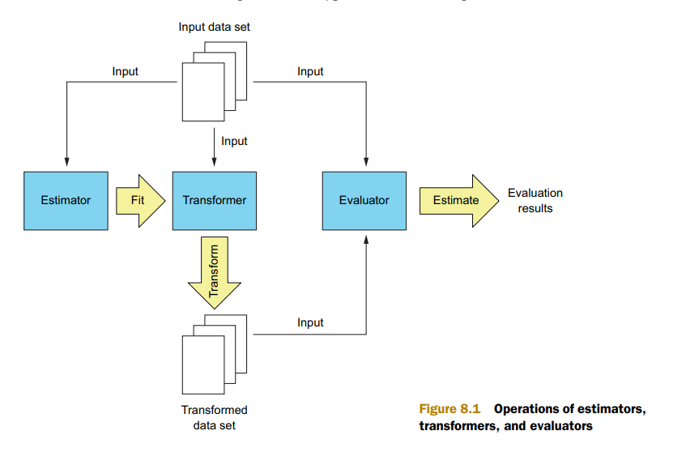

# ch8 스파크 ML로 만드는 분류와 군집화

---

- **분류**
    - 범주형 목표 변수(지도학습의 한 갈래)
    - 일정 집합으로 한정된 변수 값을 예측하는 기법
    - e.g)
        - 손글씨, 오이분류, 당도 높은 수박분류, 과일분류
- **군집화**
    - 입력 데이터를 클래스로 그루핑
    - 하지만 정확한 레이블 데이터가 없이도 가능
    - 즉, 비지도 학습

- **스파크**에서 **사용 가능**한 **분류** 알고리즘
    - **로지스틱 회귀**
    - **Naive Bayes**
    - **SVM**
    - **Random forest**
- 군집화
    - K-means clustering
    

# 8.1 스파크 ML 라이브러리

---

- 스파크 1.2  ML 라이브러리 MLlib 확장성, 유연성 해결하기 위해서 나왔다.
- ML 라이브러리 목표
    - 머신러닝 사용하는 연산들을 일반화해 머신러닝 과정을 간소하게 만드는 것
    - scikit-learn 라이블러리 영향 받아 **estimator, transformer, evaluator**라는 개념 도입
    - 객채들을 결합하여 pipeline 구성 가능
    - 각 객체에 필요한 ml 매개변수들을 일관된 방법으로 적용 가능
- 스파크 ML 모든 클래스는 DataFrame 객체를 사용해 데이터셋을 표현한다.
    - MLlib에 구현된 ML알고리즘을 ML라이브러리로 이관하는 일이 간단하지 않음
- 스파크 ML 주요 컴포넌트
    - estimator(추정자)
    - transformer(변환자)
    - evaluator(평가자)
    - ML 매개변수
    - 파이프라인

## 8.1.1 **Transformer**, Estimator, Evaluator

---

- **Transformer**
    - 스파크 ML에서 transformer를 사용하여 한 데이터셋을 다른 데이터셋으로 변환할 수 있다.
- **Estimator**
    - 주어진 데이터셋을 학습해 transformer를 생성한다.
    - e.g)
        - 선형회귀 알고리즘은 데이터 셋에서 가중치와 y절편을 학습해 transformer, (선형회귀모델)을 생성한다.
    - **estimator**의 핵심 메서드 **fit**은
        - transformer와 마찬가지로 **DataFrame**을 **필수 인수로 받**고, 
        **선택인수**로 **매개변수 집합을 받는**다.
- **Evaluator**
    - 모델 성능을 단일 지표로 평가한다.
        - e.g)
            - 회귀 모델 평가자는 RMSE와 $R^2$를 평가 지표로 사용할 수 있다.
    
    
    
    - 그림 8.1
        - transformer, estimator, evaluator 연산 과정
    

## 8.1.2 ML 매개변수

---

- 스파크 ML estimator, transformer에 ML 매개변수를 지정하는 방식을 일반화
- 스파크 ML에서 Param, ParamPair, ParamMap 클래스를 사용해 모든 estimator와 transformer의 매개변수를 동일한 방식으로 지정할 수 있다.
    - Param 클래스로 매개변수 유형을 정의
    - Param클래스에 저장되는 것
        - 매개변수 이름
        - 클래스타입
        - 매개변수 설명
        - 매개변수 검증할 수 있는 함수
        - 매개변수의 기본 값
- ML매개변수는 2가지 방식으로 지정 가능
    1. ParamPair 또는 ParamMap 객체를 추정자의 fit메서드 또는 transformor 메서드에 전달하는 것
    2. 각 매개변수의  set 매서드를 호출하는 것
        - e.g)
            - 이름이 linreg인 LinearRegression 객체가 있을때
            - 이 객체의 setRegParam(0.1)을 직접 호출하거나 fit메서드에 ParamMap(linreg.regParam → 0.1) 객체를 전달해 매개변수를 지정할 수 있다.

## 8.1.3 ML 파이프라인

---

- ML에서 최적의 결과를 내는 매개변수 값을 찾으려고 변수값을 조금씩 바꾸어 가며 동일한 계산 단계를 같은 순서로 반복할때가 잦다.
- 스파크 ML에서는 모델 학습 단계 매번 수작업 반복 대신 모델 학습 단계를 단일 Pipeline 객체로 구성할 수 있다.
- e.g) 고차 다항식 모델
    1. 데이터셋에 고차 다항식을 추가하는 변환 작업을 수행
    2. 선형 회귀 분석을 수행
    - 그런 다음 두 단계를 Pipeline 객체로 구성
    - 파이프라인은 하나의 estimator처럼 작업을 수행하며 그 결과로 PipelineModel transformer를 생성한다.
    - **PipelineModel**은 앞서 만든 pipeline과 마찬가지로 **다항식 확장**과 **선형회귀 분석** **2단계로 구성**된다.
    - 마지막으로 PipelineModel을 사용해 모델 성능 확인
    - 여러 조합의 매개변수의 값을 전달하여 pipeline을 반복 실행
    가장 좋은 결과를 기록한 변수 값의 조합을 선택할 수 있다.
    - **ML Pipeline은 학습단계가 길고 복잡할수록 더욱 편리하다.**

# 8.2 로지스틱 회귀

---

- **분류 분석의 목표**
    - 입력 예제들을 **두 개 또는 더 많은 클래스로 구별**하는 것
- **로지스틱 회귀**
    - 특정 예제가 **특정 클래스에 속할 확률**을 계산한다.

## 8.2.1 이진 로지스틱 회귀 모델

---

- 이진분류문제
    - 선형 회귀로도 풀수있다.
    - e.g) **주택 데이터셋** 선형 회귀로 모델로 학습후 모델이 에측한 값이 임의의 threshold 보다 크면 1, 작으면 0이라고 예측 가능
        - 하지만 선형 회귀는 이러한 범주형 변수 예측에 적합하도록 설계되지 않았다.
        - 로지스틱 회귀 같은 분류 알고리즘은 예제 x(벡터)가 특정 범주에 속할 확률 p(x)를 계산할 수 있다.
        - 기본적으로 확률 값 0~1사이값
        - 선형회귀 계산 결과는 이 범위를 벗어난다.
        - 즉 확률 p(x)를 선형 공식으로 모델링하면 아래와 같다.
            
            
            
- **로지스틱 회귀**
    - 위에 공식 대신 **로지스틱 함수를 사용하여 확률을 모델링**한다.
        
        
        
    
    
    
    - 8.2 그림
        - 서로 다른 가중치 w 두개를 로지스틱 함수에 대입해 확률 값을 계산한 결과를 그린 것
        - 왼쪽
            - $w_0$  ⇒ 0
            - $w_1$ ⇒ 1
        - 오른쪽
            - $w_0$  ⇒ 4
            - $w_1$ ⇒ -2
        - 가중치 매개변수 $w_0$은 로지스틱 함수의 step을 X축의 왼쪽 또는 오른쪽 방향으로 옮긴느 역할
        - $w_1$은 step의 기울기를 변경하고 계단의 수평 위치에도 영향
        - 로지스틱은 항상 0 ~ 1사이에 있기에 확률을 모델링하는데 더 적합하다.
    - 로지스틱 함수 공식을 통해 아래 공식 도출
        
        
        
        - 좌변을 odds(공산, 승산)
            - 어떤 사건이 발생할 확률을 그 반대 경우의 확률로 나눈 값
        - 양변에 자연로그 적용
            
            
            
    
    - 좌변을 **logit(log-odds)**라고 한다.
    - 로짓과 x사이에 선형관계가 있다.
    - 벡터 w에는 선형 함수의 y절편($w_0$)이 포함되므로 $x_0$는 1이다.
    - 예제 주택가격 예측을 가지고 했을때
        
        p(x)는 벡터 x가 1이라는 클래스에 속할 확률(평균가격이 3만달러 이상)
        
        1-p(x)는 반대의 경우의 확률(평균가격이 3만달러 미만)
        
        
        
        - x와 가중치 매개변수 벡터 w가 주어졌을 때 해당 예제 1의 범주에 속할 확률
        - 로지스틱 회귀는 likelihood function의 결과값이 최대가 되는 지점을 가중치 매개변수의 최적값으로 사용한다.
        - likelihood function 결과값은 회귀 모델이 데이터셋 내 모든 예제의 레이블을 올바르게 예측할 joint probability(복수의 사건이 동시에 일어날 확률)
        - 레이블이 1인 예제에서는 예측된 확률 값이 최대한 1에 가까워야한다.
            - (로지스틱 함수와 가중치값으로 계산한 결과)
        - 반대의 경우 레이블이 0인 확류률값이 최대한 0에 가까워야한다.
            
            
            
        - 이 공식 자연로그를 취하면 log-likelihood함수를 얻을 수 있다.
            
            
            
        - log-likelihood 공식을 정리하면 아래와 같다.
            
            
            
        - 경사하강법을 이용 이 cost function의 최저점을 찾을 수 있다.
        - 그외 L1 , L2 , [LBFGS](https://teamdable.github.io/techblog/Derivation-of-LBFGS-Part-4)**(**Limited-memory BFGS**)**최적화
            - 경사 하강법을 을 사용하려면 j번쨰 가중치 매개변수($w_j$)에 대한 log-likelihood function의 편도함수가 필요하다.
                
                
                

## 8.2.2 로지스틱 회귀에 필요한 데이터 준비

---

- 예제 데이터셋 로드
- 데이터 정제
- 스파크 ML API 사용할수 있게 변환
- 예제 데이터셋
    - 1994년 미국 센서스 데이터에서 추출한 성인 인구 통계 데이터 셋

- 아래와 같이 데이터 셋 로드
- double로 변환 가능 한 모든값을 double로 변환, 변환 불가능한것들은 문자열로 남긴다.

```scala
import spark.implicits._

//section 8.2.2
val **census_raw** = sc.textFile("first-edition/ch08/adult.raw", 4).map(x => x.split(",").map(_.trim)).
    **map**(row => row.**map**(x => try { x.**toDouble** } catch { case _ : Throwable => x }))
```

```python
from __future__ import print_function

#section 8.2.2
def toDoubleSafe(v):
    try:
        return **float**(v)
    except ValueError:
        return v

census_raw = sc.textFile("first-edition/ch08/adult.raw", 4).map(lambda x:  x.split(", "))
census_raw = census_raw.map(lambda row:  [toDoubleSafe(x) for x in row])
```

```scala
import org.apache.spark.sql.types.{StructType,StructField,StringType,DoubleType}
val adultschema = StructType(Array(
    StructField("age",DoubleType,true),
    StructField("workclass",StringType,true),
    StructField("fnlwgt",DoubleType,true),
    StructField("education",StringType,true),
    StructField("marital_status",StringType,true),
    StructField("occupation",StringType,true),
    StructField("relationship",StringType,true),
    StructField("race",StringType,true),
    StructField("sex",StringType,true),
    StructField("capital_gain",DoubleType,true),
    StructField("capital_loss",DoubleType,true),
    StructField("hours_per_week",DoubleType,true),
    StructField("native_country",StringType,true),
    StructField("income",StringType,true)
))
import org.apache.spark.sql.Row
val dfraw = spark.createDataFrame(census_raw.map(Row.fromSeq(_)), adultschema)
dfraw.show()
```

```python
from pyspark.sql.types import *
columns = ["age", "workclass", "fnlwgt", "education", "marital_status",
    "occupation", "relationship", "race", "sex", "capital_gain", "capital_loss",
    "hours_per_week", "native_country", "income"]
adultschema = StructType([
    StructField("age",DoubleType(),True),
    StructField("capital_gain",DoubleType(),True),
    StructField("capital_loss",DoubleType(),True),
    StructField("education",StringType(),True),
    StructField("fnlwgt",DoubleType(),True),
    StructField("hours_per_week",DoubleType(),True),
    StructField("income",StringType(),True),
    StructField("marital_status",StringType(),True),
    StructField("native_country",StringType(),True),
    StructField("occupation",StringType(),True),
    StructField("race",StringType(),True),
    StructField("relationship",StringType(),True),
    StructField("sex",StringType(),True),
    StructField("workclass",StringType(),True)
])
from pyspark.sql import Row
dfraw = sqlContext.createDataFrame(census_raw.map(lambda row: Row(**{x[0]: x[1] for x in zip(columns, row)})), adultschema)
dfraw.show()
```

### 8.2.2.1 결측값 다루기

---

- 일부 칼럼의 결측  값 처리
- 다양한 방식으로 처리 가능
    - 특정 column의 데이터가 과도하게 누락되어 있다면 
    예측결과에 부정적인 영향을 줄 수 있으므로 이 column의 모든 데이터를 데이터셋에서 제거 가능
    - 개별 예제(row)에 데이터가 누락된 칼럼이 많다면, 이 row를 데이터셋에서 제거 가능
    - 각 column의 결측 값을 해당 column의 가장 일반적인 값으로 대체할 수 있다.
        - 일반적으로 많이 쓰인다. 최빈값으로 결측값을 대체한다.
    - 별도의 분류 또는 회귀 모델을 학습해 **결측 값을 예측**할 수 있다.
        - 시간 소요가 많이 됨

```scala
// 빈도 확인
dfraw.**groupBy**(dfraw("workclass")).**count**().rdd.foreach(println)

//Missing data imputation
val dfrawrp = **dfraw**.na.**replace**(Array("workclass"), Map("?" -> "Private"))
val dfrawrpl = dfrawrp.na.replace(Array("occupation"), Map("?" -> "Prof-specialty"))
val dfrawnona = dfrawrpl.na.replace(Array("native_country"), Map("?" -> "United-States"))
```

```python
dfraw.**groupBy**(dfraw["workclass"]).count().foreach(print)

#Missing data imputation
**dfrawrp** = dfraw.na.**replace**(["?"], ["Private"], ["workclass"])
dfrawrpl = dfrawrp.na.replace(["?"], ["Prof-specialty"], ["occupation"])
dfrawnona = dfrawrpl.na.replace(["?"], ["United-States"], ["native_country"])
```

### 8.2.2.2 범주형 변수 다루기

---

- 분류 알고리즘은 범주형 변수를 다룰 수 없다.
- 따라서 데이터 셋의 문자열 값을 숫자로 변환해야햔다.
- 문자열 값을 단순히 연속딘 숫자로 인코딩하면 숫자값에 따라 범주 순위를 매기는데 보통 범주에 순위를 매길 수 없음으로 적절하지 않다.
    - e.g)
    - **marital status**
        - separated, divorced, never married, widowed, married
        - 각 각 0~4 사이의 정수로 인코딩한다고 가정
        - 하지만 이 숫자들로 column 값의 의미를 해석할 수 있는 없다.
            - 미혼상태 혹은 결혼, 이혼등의 상태가 별거 상태보다 크다고 할수 없으니까 그렇다.
        - 그래서 범주형 변수에는 일반적으로 숫자 인코딩 대신 one-hot encoding을 사용

- one-hot encoding은 범주형 컬럼을 다수의 binary 컬럼으로 확장하는 기법
- binary 컬럼의 개수는 원래 범주형 컬럼이 가진 범주의 개수와 동일하다.
- one-hot encoding을 각 row에 적용하면 binary 컬럼 중 단하나
    - 원래 범주형 칼럼 값에 해당하는 binary 칼럼의 값만 1이고 나머지 칼럼 값은 0이 된다.
    - marital status 컬럼은 범주 개수가 4개이므로 binary 컬럼 5개로 확장할 수 있다.


- 스파크 ML 라이브러리에서는 아래 3개 클래스를 사용하여 범주형 변수를 다룰 수 있다.
    - **StringIndexr**
    - **OneHotEncoder**
    - **VectorAssembler**

### 8.2.2.3 StringIndexer 사용

---

- **데이터 준비 첫번쨰 단계(1/3)**
- **StringIndexer**는 **String** 타입의 범주 값을 해당 값의 정수 번호로 변환한다.
- **DataFrame**을 바탕으로 **StringINdexerModel**을 학습하고 컬럼 변환에 사용한다.
- 변환하려는 범주형 컬럼이 많다면 **StringIndexerModel**도 이와 동일한 개수만큼 학습해야한다.
- **IndexStringColumns** 메서드를 선언해 사용하면 여러 컬럼을 손쉽게 변환 할 수 있다.

```scala
//converting strings to numeric values
import org.apache.spark.sql.DataFrame
def indexStringColumns(df:DataFrame, cols:Array[String]):DataFrame = {
    import org.apache.spark.ml.feature.StringIndexer
    import org.apache.spark.ml.feature.StringIndexerModel
    //variable newdf will be updated several times
    var newdf = df
    for(c <- cols) {
        val si = new StringIndexer().setInputCol(c).setOutputCol(c+"-num")
        val sm:StringIndexerModel = si.fit(newdf)
        newdf = sm.transform(newdf).drop(c)
        newdf = newdf.withColumnRenamed(c+"-num", c)
    }
    newdf
}
val dfnumeric = indexStringColumns(dfrawnona, Array("workclass", "education", "marital_status", "occupation", "relationship", "race", "sex", "native_country", "income"))
```

```python
#converting strings to numeric values
def indexStringColumns(df, cols):
    from pyspark.ml.feature import StringIndexer
    #variable newdf will be updated several times
    newdf = df
    for c in cols:
        si = StringIndexer(inputCol=c, outputCol=c+"-num")
        sm = si.fit(newdf)
        newdf = sm.transform(newdf).drop(c)
        newdf = newdf.withColumnRenamed(c+"-num", c)
    return newdf

dfnumeric = indexStringColumns(dfrawnona, ["workclass", "education", "marital_status", "occupation", "relationship", "race", "sex", "native_country", "income"])
```

### 8.2.2.4 OneHotEncoder로 데이터 인코딩

---

- 데이터 준비 2번째 단계(2/3)
- OneHotEncoder클래스는 지정된 칼럼에 one-hot encoding 적용, 인코딩 결과를 새로운 칼럼에 저장한다.
- StringIndexer와 마찬가지로 다음과 같이 oneHotEncdeColumns 메서드를 선언하면 여러 칼럼에 one-hot encoding을 적용할 수 있다.

```scala
def **oneHotEncodeColumns**(df:DataFrame, cols:Array[String]):DataFrame = {
    import org.apache.**spark**.ml.feature.OneHotEncoder
    var newdf = df
    for(c <- cols) {
        val onehotenc = new OneHotEncoder().setInputCol(c)
        onehotenc.setOutputCol(c+"-onehot").setDropLast(false)
        newdf = onehotenc.transform(newdf).drop(c)
        newdf = newdf.withColumnRenamed(c+"-onehot", c)
    }
    newdf
}
val dfhot = **oneHotEncodeColumns**(**dfnumeric**, Array("workclass", "education", \
"marital_status", "occupation", "relationship", "race", "native_country"))
```

```python
def oneHotEncodeColumns(df, cols):
    from **pyspark**.ml.feature import OneHotEncoder
    newdf = df
    for c in cols:
        onehotenc = OneHotEncoder(inputCol=c, outputCol=c+"-onehot", dropLast=False)
        newdf = onehotenc.transform(newdf).drop(c)
        newdf = newdf.withColumnRenamed(c+"-onehot", c)
    return newdf

dfhot = **oneHotEncodeColumns**(dfnumeric, ["workclass", "education", "marital_status", \
"occupation", "relationship", "race", "native_country"])
```

### 8.2.2.5 VectorAssembler로 데이터 병합

---

- 데이터 준비 마지막 단계(3/3)
- **one-hot encoder**로 생성한 Vector 컬럼들과 데이터셋의 다른 컬럼들을 모아서 **모든 특징 변수를 포함하는 단일 Vector 컬럼으로 병합**하는 것

```scala
import org.apache.spark.ml.feature.VectorAssembler
val va = new VectorAssembler().setOutputCol("features")
va.setInputCols(dfhot.columns.diff(Array("income")))
val lpoints = va.transform(dfhot).select("features", "income").withColumnRenamed("income", "label")
```

```python
from pyspark.ml.feature import VectorAssembler
va = VectorAssembler(outputCol="features", inputCols=dfhot.columns[0:-1])
lpoints = va.transform(dfhot).select("features", "income").withColumnRenamed("income", "label")
```

## 8.2.3 로지스틱 회귀 모델 훈련

---

- 스파크 MLlib에서는 LogisticRegressionWithSGD 클래스나 LogisticRegressionWithBFGS 클래스를 사용해 로지스틱 회귀 모델을 훈련 가능
- 새로운 스파크 ML  API에서는 LogisticRegression 클래스를 사용한다.
    - 이 클래스는 ML 라이브러리의 LogisticRegressionModel객체를 반환한다.
    - 데이터를  무작위 분할하는 **randomSplit** 사용
    - 분할한 **두 데이터셋**(train, test)을 **메모리에 캐싱**
    - ML 알고리즘은 동일한 작업을 반복하면서 동일한 데이터를 재사용하므로 데이터를 캐시하는것이 좋다

```scala
//section 8.2.3
val splits = lpoints.**randomSplit**(Array(0.8, 0.2))
val adulttrain = splits(0).**cache**()
val adultvalid = splits(1).cache()
```

- LogisticRegression 객체에 몇가지 매개변수를 설정
- 이 객체의 fit 메서드에 훈련 데이터셋의 DataFrame을 전달해 로지스틱 회귀 모델 훈련

```scala
import org.apache.spark.ml.classification.LogisticRegression
val lr = new LogisticRegression
lr.**setRegParam**(0.01).**setMaxIter**(1000).**~~setFitIntercept~~**(true)
//
val lrmodel = lr.**fit**(adulttrain)
import org.apache.spark.ml.param.ParamMap
val lrmodel = lr.fit(adulttrain, ParamMap(lr.regParam -> 0.01, lr.maxIter -> 500, lr.fitIntercept -> true))
// 매개변수를 직접 지정가능하다.

```

```python
#section 8.2.3
splits = lpoints.randomSplit([0.8, 0.2])
adulttrain = splits[0].cache()
adultvalid = splits[1].cache()

from pyspark.ml.classification import **LogisticRegression**
lr = **LogisticRegression**(regParam=0.01, maxIter=1000, fitIntercept=True)
lrmodel = lr.fit(adulttrain)
lrmodel = lr.**setParams**(regParam=0.01, maxIter=500, fitIntercept=True).fit(adulttrain)

```

### 8.2.3.1 모델의 가중치 매개변수 해석

---

```scala
lrmodel.coefficients 
lrmodel.intercept
```

```python
lrmodel.weights
lrmodel.intercept
```


- 숫자들의 의미
    - 선형회귀 모델이 학습한 각 특징 변수의 가중치 값은 해당 특징 변수의 중요도
    목표변수에 미치는 영향력과 직결된다.
    - **로지스틱** 회귀 모델의 핵심은 각 데이터 샘플이 특정 범주에 속할 확률이지만
    모델의 가중치는 이 확률에 선형적인 영향을 미치지 않는다.
    - 그 대신 모델의 가중치는 **log-odds에 선형적인 영향을 미친다.**
    
    
    
    - l**og-odds 공식**에서 **데이터 샘플**이 **특정 범주에 속할 실제 odds**를 계산하는 **공식을 도출** 가능
    
    
    
- 개별 가중치 매개변수가 확률에 미치는 영향을 알아보는 방법
    - 각 가중치에 해당하는 특징 변수 값에 1을 더하고 다른 특징 변수 값은 그대로 유지했을 때 확률값이 어떻게 달라지는지 살펴보는 것
    - e.g) $x_1$ 에 1을 더하는 것은 odds에 $e^{w_i}$를 곱하는 것과 같다.

## 8.2.4 분류 모델의 평가

---

- 학습된 모델이 검증 데이터셋에서 얼마나 잘 동작하는지 확인
- 로지스틱 회귀 모델(lrmodel) 사용하여 데이터셋 변환 후 BinaryClassificationEvaluator로 모델 성능을 평가한다.

```scala
val validpredicts = lrmodel.transform(adultvalid)
```

```python
validpredicts = lrmodel.transform(adultvalid)
```


- probaablility z칼럼에 저장된 벡터에는 해당 데이터 샘플이 관심 범주에 속하지 않을 확률과 속할 확률이 저장된다.( 연 수입 5만달러 이하일 확률)
두 확률 값의 합은 항상 1
- rawPrediction컬럼에 저장된 벡터에도 해당 데이터 샘플이 관심 범주에 속하지 않을 로그 오즈와 속할 log-odds가 포함된다.
이 두 log-odds값은 절대 값은 같지만 부호는 서로 반대이다.
- prediction 칼럽 값은 1 또는 0이며, 해당 데이터 샘플이 관심 범주에 속할 가능서잉 높은지를 의미한다.
- 로지스틱 회귀는 probabiliry칼럼 값이 특정 임계치(default: 0.5)보다 클때 관심 범주에 속할 가능성이 높다고 판단한다.
- validpredicts DataFame의 모든 칼럼 이름은 임의대로 변경할 수 있다.
    - outputCol, rawPredictionCol, probabilirtCol등의 매개변수 사용하여 변경
    

### 8.2.4.1 BinaryClassificationEvaluator 사용

---

```scala
import org.apache.spark.ml.evaluation.BinaryClassificationEvaluator
val bceval = new **BinaryClassificationEvaluator**()
bceval.**evaluate**(validpredicts)
```


```scala
bceval.**getMetricName**
```


```scala
bceval.**setMetricName**("areaUnderPR")
bceval.**evaluate**(validpredicts)
```

- **python version**

```python
from pyspark.ml.evaluation import **BinaryClassificationEvaluator**
bceval = **BinaryClassificationEvaluator**()
bceval.evaluate(validpredicts)
bceval.getMetricName()

bceval.setMetricName("areaUnderPR")
bceval.evaluate(validpredicts)
```


- 이 지표는 **ROC곡선의 밑면적** (AUROC)이다.
- bceval.setMetricName("areaUnderPR")을 호출해 BinaryClassifincationEvaluator의 설정을 변경하면 분류 문제의 또 다른 지표인 **정밀도-재현율 곡선의 밑면적**(AUPRC)을 계산할 수 있다.

### 8.2.4.2 정밀도와 재현율

---

- 분류 모델의 성능평가를 위한 TP(True Positive), FP(False Positive) 개수를 집계해야한다.
- TP
    - 제대로 양성으로 분류한 경우
    - 근성장을 했을 것이라 예측했는데 진짜 근성장한 경우
- FP
    - 가짜 양성
    - 근성장을 했을 것이라 예측했는데 실제로는 근성장하지 못한 경우
- TN
    - 진짜 음성
    - 근성장 못했다고 예측하였고 실제로도 근성장하지 않은 경우
- FN
    - 가짜 음성
    - 근성장 못했다고 했는데 실제로는 근성장한 경우
- **정밀도(Precision, P)**
    - 모델이 양성이라고 판단한 예제 중에서 진짜 양성 예제가 차지하는 비율
- **재현율(Recall, R)**
    - 모든 양성 예제 중에서 모델이 양성으로 식별한 예제의 비율


- 모델의 에측결과가 모두 0일 경우
진짜 양성 가짜양성이 없으면 정밀도, 재현율 모두 0이 된다.
- 반대로 모든 예제를 1로 예측한다면 재현율은 1이 되고 정밀도는 데이터셋에 따라 다른 값이 계산된다
- **F1-Score**
    - 분류모델 평가에 주로 사용된다.
    - 정밀도와 재현율의 조화 평균으로 계산한다.
    
    
    
    - 정밀도, 재현율 모두 0일떄 F1 score도 0이 되며, 두 지표 모두 1에 가깝다면 F1 score도 1에 가깝게 계산된다.

### 8.2.4.3 정밀도-재현율 곡선

---

- 데이터 샘플이 관심 범주에 속하는지 여부를 판단하는 확률 임계치를 조금씩 변경하면서
**각 임계치마다 모델의 정밀도와 재현율을 계산**하고, 
이를 하나의 그래프(정밀도 Y축, 재현율 X축)에 그리면 PR(정밀도, 재현율) 곡선을 얻을 수 있다.


- 확률 임계치를 높이면 가짜 양성이 줄어들면서 정밀도가 상승한다.
하지만 데이터셋의 실제 양성을 더 적게 식별하므로 재현율이 하락한다.
- 반대로 임계치를 낮추면 가짜양성이 많아지므로 정밀도는 떨어지지만 재현율이 상승한다.
- 모델의 확률 임계치 변경은 **setThreshold** 메서드 사용

### 8.2.4.4 ROC곡선

---

- BinaryCalssifincationEvaluator 클래스의 두 번째 평가 지표 ROC 곡선의 밑면적(AUPRC)
- ROC 곡선은 PR 곡선과 유사하지만 재현율(TPR)을 Y축에 그리고 가짜양성률(FPR)을 X축에 그린다는 점잉 다르다.
- 가짜 양성률은 모든음성 샘플 대비 가짜양성의 비율로 계산한다.
    
    
    
- FPR은 모든 음성 데이터 샘플 중에서 **모델이 양성으로 잘못 판별한 샘플의 비율**이다.
    
    
    
- 이상적인 모델은 FPR이 낮고 TPR이 높아야하며, 따라서 ROC곡선도 왼쪽 위 모서리에 가깝게 그려져야한다.
- **대각선에 가까운 ROC곡선**은 **모델이 거의 무작위에 가까운 결과를 예측하는** 뜻
- 데이터 셋 중 양성 예제의 비율이 낮을 때는 ROC곡선보다는 PR 곡선을 사용하는 것이 더 적절하다
- 지금까지 살펴보았듯이 **ROC곡선과 PR곡선은 여러 모델의 성능을 비교하는데 사용**한다.

## 8.2.5 k-겹 교차 검증 수행

---

- k-fold cross validation
    - k개 파트로 나눈 데이터를 각각 학습하고 각 검증데이터셋 결과값의 평균을 최종 결과로 사용한다.
    - 더욱 안정적이고 특정부분에 모델이 과적합될 가능성도 줄일 수 있다.


- k-fold cross validation의 매개변수 값을 찾는 과정은 다음과 같다.
- 매개변수 값의 각 조합별로 모델 k를 학습한 후 각 모델의 오차를 계산하고 평균을 구한다.
- **모든 조합의 평균 오차를 계산**하고 **가장 낮은 값을 기록한 조합을 최종 선택**한다.
- 스파크 ML CrossValidation 클래스로 자동화 할 수 있다.

```scala
import org.apache.spark.ml.tuning.CrossValidator
val cv = new CrossValidator().setEstimator(lr).setEvaluator(bceval).setNumFolds(5)
```

- CrossValidator 클래스에 estimator, evaluator를 각각 전달하고 k-fold(default: 3)를 설정
- CrossValidator의 setEstimatorParamMaps 메서드에 매개변수 값의 조합을 전달한다.
- CrossValudator는 각 ParamMap객체별로 k-fold cv를 수행한다.
- ParamGridBuilder 클래스를 사용하여 매개변수 값의 조합을 ParamMap 배열 형태로 손쉽게 생성할 수 있다.
- 각 매개변수에 지정할 변수 값들을 grid 갤체로 만들 어 추가한 후 build 메서드를 호출하여 전체 그리드 생성

```scala
import org.apache.spark.ml.tuning.ParamGridBuilder
val **paramGrid** = new ParamGridBuilder().**addGrid**(lr.maxIter, Array(1000)).
    **addGrid(**lr.regParam, Array(0.0001, 0.001, 0.005, 0.01, 0.05, 0.1, 0.5)).**build**()
```

- 매새변수 grid를 CrossValidator에 전달

```scala
**cv**.**setEstimatorParamMaps**(**paramGrid**)
```

- CrossValidator(cv)의 fit 메서드를 호출하면 CrossValidator는 매개변수의 각 조합별로 모델을 학습하고, 앞서 전달한 평가자(bceval)의 측정 지표를 기준으로 가장 좋은 성능을 기록한 모델을 반환한다.

```scala
val cvmodel = **cv**.fit(adulttrain)
```

- cvmodel 는 CrossValudatorModel 타입의 객체
    - bestModel 필드로 가정 좋은 성능을 기록한 로지스틱 회귀 모델을 가져올 수 있다.

```scala
cvmodel.bestModel.asInstanceOf[LogisticRegressionModel].**coefficients**
```


- **bestModel**의 **부모 클래스를 사용**해 **가장 좋은 성능을 기록**한
**일반화 매개변수 값도 가져올 수** 있다(**`파이썬에서는 불가`**)

```scala
cvmodel.bestModel.parent.asInstanceOf[LogisticRegression].getRegParam
```


- 0.0001일때 가장 좋은 결과

```scala
new BinaryClassificationEvaluator().evaluate(cvmodel.bestModel.transform(adultvalid))
```

- 검증 데이터 셋을 사용 모델 성능을 테스트


- python

```python
from pyspark.ml.tuning import CrossValidator
from pyspark.ml.tuning import ParamGridBuilder
cv = **CrossValidator**().**setEstimator**(lr).setEvaluator(bceval).setNumFolds(5)

paramGrid = **ParamGridBuilder**().**addGrid**(lr.maxIter, [1000]).addGrid(lr.regParam, \
[0.0001, 0.001, 0.005, 0.01, 0.05, 0.1, 0.5]).**build**()

cv.**setEstimatorParamMaps**(**paramGrid**)
cvmodel = cv.**fit**(adulttrain)
cvmodel.**bestModel**.**weights**

**BinaryClassificationEvaluator**().**evaluate**(**cvmodel**.**bestModel**.**transform**(**adultvalid**))
```

## 8.2.6 다중 클래스 로지스틱 회귀

---

- 다중 클래스 분류
    - 입력 예제를 3개 이상의 클래스로 식별하는 분류 문제
- MLlib의 logisticRegressionWIthLBFGS를 사용 가능
- **이진 분류 모델을 사용해 다중 클래스 분류를 수행**하는 One Vs. Rest(**OVR**) 전략 사용
- **OVR**(OneVsRest)
    - 각 클래스당 **모델을 하나씩 훈련**시키면서 **다른 클래스들을 음성으로 간주**하는 방식 사용
    - **새로운 데이터 샘플을 분류할때**는 **훈련된 모든 모델에 이 샘플을 입력으로** 전달하고,
    **`가장 높은 확률`을 출력하는 `모델의 클래스를 샘플 레이블로 예측`**한다.
- 스파크 ML의 OneVsRest
    - OneVsRest 는 데이터셋 변환에 사용할 수 있는 OneVsRestModel을 생성
- **손글씨** 분류 예제

```scala
import org.apache.spark.sql.types.{StructType,StructField,StringType,IntegerType}
val penschema = **StructType**(Array(
    StructField("pix1",IntegerType,true),
    StructField("pix2",IntegerType,true),
    StructField("pix3",IntegerType,true),
    StructField("pix4",IntegerType,true),
    StructField("pix5",IntegerType,true),
    StructField("pix6",IntegerType,true),
    StructField("pix7",IntegerType,true),
    StructField("pix8",IntegerType,true),
    StructField("pix9",IntegerType,true),
    StructField("pix10",IntegerType,true),
    StructField("pix11",IntegerType,true),
    StructField("pix12",IntegerType,true),
    StructField("pix13",IntegerType,true),
    StructField("pix14",IntegerType,true),
    StructField("pix15",IntegerType,true),
    StructField("pix16",IntegerType,true),
    StructField("label",IntegerType,true)
))
val pen_raw = sc.textFile("first-edition/ch08/penbased.dat", 4).map(x => x.split(", ")).
    map(row => row.map(x => x.toDouble.toInt))

import org.apache.spark.sql.**Row**
val dfpen = spark.**createDataFrame**(pen_raw.map(Row.fromSeq(_)), penschema)

import org.apache.spark.ml.feature.**VectorAssembler**
val va = new **VectorAssembler**().**setOutputCol**("features")
va.**setInputCols**(dfpen.columns.diff(Array("label")))
val **penlpoints** = va.**transform**(dfpen).select("features", "label")
```

- 데이터셋을 스파크에 로드

```scala

val pensets = penlpoints.randomSplit(Array(0.8, 0.2))
val pentrain = pensets(0).cache()
val penvalid = pensets(1).cache()
```

- train, test 분리
- 앞에와 동일하게 캐시 사용(재활용 되니까 연산상의 이점을 위해)

```scala
import org.apache.spark.ml.classification.OneVsRest
val **penlr** = new **LogisticRegression**().setRegParam(0.01)
val **ovrest** = new OneVsRest()
**ovrest**.**setClassifier**(**penlr**)
```

- OneVsRest에 사용할 분류 알고리즘 지정

```scala
val **ovrestmodel** = ovrest.**fit**(pentrain)

val **penresult** = **ovrestmodel**.**transform**(penvalid)
```

- train 데이터 셋을 이용 모델 학습
- ovrestmodel 을 이용 penvalid을 변환
- 책 버젼이 스파크ML이 다중 클래스 분류의 평가 객체를 지원하지 않았던 시점이므로
클래스 사용하려면 **예측 레이블과 실제 레이블의 투플로 구성된 RDD 필요**

```scala
val penPreds = penresult.select("prediction", "label").**rdd**.**map**(row => (row.getDouble(0), row.getDouble(1)))

import org.apache.spark.mllib.evaluation.MulticlassMetrics
val penmm = new **MulticlassMetrics**(penPreds)
penmm.**precision**
//0.9018214127054642
penmm.precision(3)
//0.9026548672566371
penmm.recall(3)
//0.9855072463768116
penmm.fMeasure(3)
//0.9422632794457274
```

- MulticlassMetrics에서 제공하는 메서드를 이용하여 confusionMatrix 표현

```scala
penmm.**confusionMatrix**
// 228.0  1.0    0.0    0.0    1.0    0.0    1.0    0.0    10.0   1.0
// 0.0    167.0  27.0   3.0    0.0    19.0   0.0    0.0    0.0    0.0
// 0.0    11.0   217.0  0.0    0.0    0.0    0.0    2.0    0.0    0.0
// 0.0    0.0    0.0    204.0  1.0    0.0    0.0    1.0    0.0    1.0
// 0.0    0.0    1.0    0.0    231.0  1.0    2.0    0.0    0.0    2.0
// 0.0    0.0    1.0    9.0    0.0    153.0  9.0    0.0    9.0    34.0
// 0.0    0.0    0.0    0.0    1.0    0.0    213.0  0.0    2.0    0.0
// 0.0    14.0   2.0    6.0    3.0    1.0    0.0    199.0  1.0    0.0
// 7.0    7.0    0.0    1.0    0.0    4.0    0.0    1.0    195.0  0.0
// 1.0    9.0    0.0    3.0    3.0    7.0    0.0    1.0    0.0    223.0
```

# 8.3 의사 결정 트리와 랜덤 포레스트

---

- **의사결정 트리**
    - **트리 알고리즘**의 **형태의 규칙 집합**을 **특징 변수에 적용해 입력 예제를 분류**한다.
    - 규칙집합은 trian 데이터셋에서 자동으로 학습하거나 사용자가 직접 작성할 수 있다.
    - **장점**
        - 알고리즘이 복잡한 수학 기반이 아니라 간편하고 이해하기 쉽다.
        - 의사 결정 규칙 그림으로 표현 가능
        - 데이터 정규화할 필요가 없다.
        - 숫자형, 범주형 데이터 모두 처리 가능
        - 결측 값에 큰 영향을 받지 않는다.
    - **단점**
        - 과적합에 빠지기 쉽다.
        - 입력 데이터에 매우 민감
        - 입력 데이터 셋을 조금만 변경해도 결정 규칙이 크게 바뀌수있다.
        - 최적의 의사결정 트리 학습문제가 **NP-완전**문제
            - 정답을 찾을 수 있는 효율적인 방법이 알려져있지 않다.
            - 각 트리의 지역적 최적해를 찾는것이 현실적인 방법
            - global optimal solution을 보장하지 못한다.
- **랜덤 포레스트 알고리즘**
    - 원본 데이터셋을 무작위로 샘플링한 데이터를 사용해 의사 결정 트리 여러개를 한꺼번에 학습하는 알고리즘
    - **Esemble learning**
        - 여러 모델을 한번에 학습하는 기법
    - **Bagging**
        - 사용할 train 데이터를 무작위로 샘플링하고 모델들의 결과를 평균해 사용하는 기법
        - 분산과 과적합을 줄이는 데 도움을 준다.

## 8.3.1 의사 결정 트리

---

- **의사 결정 트리 알고리즘**
    - 각 특징 변수가 전체 훈련 데이터셋을 얼마나 잘 분류하는지 평가한다.
    - 각 특징 변수의 평가 지표로 **impurity**(불순도), information gain(정보 이득) 사용
    - **알고리즘은 최적은 특징변수**
        - 가장 정보 이득이 큰 특징변수를 골라 트리 노드를 하나 생성하고
        - 특징 변수 값에 따라 이 노드에서 다시 새로운 branch를 생성한다.
        - 특징 변수 값이 연속적일때 알고리즘은 변수 값의 전체 범위를 하위 범위로 나눈다.
        - 하위 범위 개수는 매개변수로 지정

### 8.3.1.1 알고리즘의 동작 예제

---

- 인구 데이터셋 일부 사용
- 특징 변수 중 age, sex, education, hours worked per week 사용
- income 목표 변숙밧을 범주형 레이블로 변환(소득 5만 달러 초과 1, 아니면 0)
- 샘플링 row 16개 사용


- 위 데이터 셋 사용하여 의사 결정 트리 모델 학습
- 8.7 오른쪽 표, 알고리즘 학습과정
- 첫번째 단계 age 선택
    - 알고리즘 목표 변수값에 따라 age 변수 값을 분기
    - 왼쪽 분기에는 음성 예제(5만달러 미만)만 남았기에 리프노트 생성
- 두번째 단계 sex 변수 선택
    - 첫단계와 동일한 과정 반복
    - age노드의 오른쪽 분기에 할당된 데이터셋을 다시 2개로 분할
    - sex노드의 오른쪽 분기에는 음성예제만 남았으므로 리프노드 생성
    - 왼쪽 분기를 다시 education변수로 분할
    - 마지막 두 리프 노드를 생성


### 8.3.1.2 불순도와 정보이득

---

- 의사결정 트리는 불순도(impurity)와 정보이득을 기반을 데이터셋을 분할할 특징 변수를 결정
- 의사결정 트리의 불순도(impurity)지표에는 엔트로피와 지니 불순도가 있다.
- 대부분의 ML 라이브러리는 **지니 불순도**를 기본 지표로 사용한다.
- Entropy
    - 메시지에 포함된 정보량을 측정하는 척도
    - 의사 결정 트리는 임의의 데이터셋 D의 엔트로피를 다음과 같이 계산할 수 있다.


- K는 목표변수의 클래스 개수
- P($C_j$)는 j번째 클래스 $C_j$의 비율
- 이진분류 문제에 사용한 데이터셋(그림 8.7)에서 엔트로피 계산결과는 아래와같다.


- 클래스 하나로만 구성된 데이터셋의 엔트로피는 0
- 모든 클래스가 균일하게 분포된 데이터셋의 엔트로피가 가장 높다
- **이진 분류 문제**에서 **엔트로피의 최댓값**은 **1**

- **지니 불순도**
    - 데이터셋의 실제 레이블 분포에 따라 무작위 레이블을 예측한다고 가정
    - 데이터셋에서 무작위로 고른 요소의 **레이블을 `얼마나 자주 잘못 예측`하는지 계산**한 척도


- 지니 불순도 또한 모든 클래스가 데이터셋에 균이랗게 분포되어 있을때 가장 큰 값으로 계산된다.
    - 이진 분류 0.5
- 클래스 하나로만 구성된 데이터셋에서는 0
    - 그림8.8 지니 불순도 0.4296875
- 불순도를 바탕으로 정보 이득을 계산하고 데이터 셋을 분할한다.
- **`정보이득`**은 **특징 변수 F**로 **데이터셋 D를 나누었을 때 `예상되는 불순도 감소량`**이다.


- subsets(F) 특징 변수 F값을 반할한 부분 집합(분기를 의미)
- | $D_s$| 는 분기 s에 할당된 데이터셋의 요소 개수
- |$D$| 는 분할 이전의 데이터셋에 포함된 요소 개수
- 불순도 [I(D)와 I($D_s$)]는 엔트로피 사용하여 계산
    
    
    
- age특징 변수를 그림 8.8과 다른 방식으로 분할하면 정보이득은 이보다 더 줄어들 것이다
- age ≤ 46 이라는 분기조건을 age ≤ 47로 변경하면 그림8.8 첫번째 왼쪽 분기는 더이상 단일 클래스로 구성된 노드가 아니다
- 이 분기의 불순도가 0보다 큰 값이 되면서 결과적으로 정보이득이 감소한다.
- **의사 결정 트리**의 학습 알고리즘**은** **정보이득을 사용**해 **트리의 각 노드**에서 **데이터셋을 어떻게 나눌지 결정**한다.

### 8.3.1.3 의사 결정 트리 학습

---

- 다중 클래스 로지스틱 회귀를 사용한 손글씨 데이터셋으로 의사 결정 트리 모델 훈련

```scala
import org.apache.spark.ml.feature.StringIndexer
import org.apache.spark.ml.feature.StringIndexerModel
val dtsi = new StringIndexer().setInputCol("label").setOutputCol("label-ind")
val dtsm:StringIndexerModel = dtsi.fit(penlpoints)
val pendtlpoints = dtsm.transform(penlpoints).drop("label").withColumnRenamed("label-ind", "label")
```

- 데이터 로드

```scala
val pendtsets = pendtlpoints.randomSplit(Array(0.8, 0.2))
val pendttrain = pendtsets(0).cache()
val pendtvalid = pendtsets(1).cache()
```

- 데이터 셋 분할, 및 캐싱

```scala
import org.apache.spark.ml.classification.DecisionTreeClassifier
val dt = new DecisionTreeClassifier()
dt.setMaxDepth(20)
val dtmodel = dt.fit(pendttrain)
```

- python

```python
from pyspark.ml.feature import StringIndexer
dtsi = StringIndexer(inputCol="label", outputCol="label-ind")
dtsm = dtsi.fit(penlpoints)
pendtlpoints = dtsm.transform(penlpoints).drop("label").withColumnRenamed("label-ind", "label")

pendtsets = pendtlpoints.randomSplit([0.8, 0.2])
pendttrain = pendtsets[0].cache()
pendtvalid = pendtsets[1].cache()

from pyspark.ml.classification import DecisionTreeClassifier
dt = DecisionTreeClassifier(maxDepth=20)
dtmodel = dt.fit(pendttrain)
```

- **maxDepth**
    - 트리 최대 깊이 지정 (default: 5)
- **maxBins**
    - 연속적인 값을 가지는 특징 변수를 분할할때 생성할 bin의 최대 개수를 지정(default: 32)
- **minInstancesPerNode**
    - 데이터셋을 분할할때 각 분기에 반드시 할당해야 할 데이터 샘플의 최소 개수를 지정 (default: 1)
- **minInfoGain**
    - 데이터셋을 분할할때 고려할 정보 이득의 최저 값을 지정
    - 분기의 정보 이득이 최저 값보다 낮으면 해당 분기는 버린다(default: 0)

- 최대 깊이 20으로 설정
- 모델 훈련

### 8.3.1.4 의사결정 트리 살펴보기

---

- 의사 결정 규칙 시각화

```scala
dtmodel.**rootNode**
```


- 불순도 확인

```scala
import org.apache.spark.ml.tree.**InternalNode**
dtmodel.rootNode.**asInstanceOf**[InternalNode].split.**featureIndex**
//15
```

- 어떤 특징 변수로 데이터셋 분할했는지 확인
- 15번 특징 변수는 데이터셋의 마지막 픽셀

```scala
import org.apache.spark.ml.tree.ContinuousSplit
dtmodel.rootNode.asInstanceOf[InternalNode].split.asInstanceOf[ContinuousSplit].threshold
//51
dtmodel.rootNode.asInstanceOf[InternalNode].leftChild
dtmodel.rootNode.asInstanceOf[InternalNode].rightChild
```


- 15번 특징 변수값을 분할하는데 사용한 임계치 확인
- 노드에 사용한 특징 변수가 범주형 변수일 때
    - 해당 split에는 CountinuousSplit 대신 Categories 필드로 해당 분기를 어떤 범주 값으로 분할했는지 확인 가능
    - leftChild, rightChild 왼쪽, 오른쪽 자식노드를 가져온다.

### 8.3.1.5 모델 평가

---

- 의사 결정 트리 모델을 사용하여 검증 데이터셋을 변환
- MuticlassMetrics 클래스로 모델 성능을 평가

```scala
val dtpredicts = dtmodel.transform(pendtvalid)
val dtresrdd = dtpredicts.select("prediction", "label").rdd.map(row => (row.getDouble(0), row.getDouble(1)))
val dtmm = new MulticlassMetrics(dtresrdd)
dtmm.precision
//0.951442968392121
dtmm.confusionMatrix
// 192.0  0.0    0.0    9.0    2.0    0.0    2.0    0.0    0.0    0.0
// 0.0    225.0  0.0    1.0    0.0    1.0    0.0    0.0    3.0    2.0
// 0.0    1.0    217.0  1.0    0.0    1.0    0.0    1.0    1.0    0.0
// 9.0    1.0    0.0    205.0  5.0    1.0    3.0    1.0    1.0    0.0
// 2.0    0.0    1.0    1.0    221.0  0.0    2.0    3.0    0.0    0.0
// 0.0    1.0    0.0    1.0    0.0    201.0  0.0    0.0    0.0    1.0
// 2.0    1.0    0.0    2.0    1.0    0.0    207.0  0.0    2.0    3.0
// 0.0    0.0    3.0    1.0    1.0    0.0    1.0    213.0  1.0    2.0
// 0.0    0.0    0.0    2.0    0.0    2.0    2.0    4.0    198.0  6.0
// 0.0    1.0    0.0    0.0    1.0    0.0    3.0    3.0    4.0    198.0
```

- 파이썬에서는루트 노드에 접근 불가

```python
# rootNode is not accessible in Python

**dtpredicts** = dtmodel.**transform**(**pendtvalid**)
dtresrdd = dtpredicts.select("prediction", "label").rdd.map(lambda row:  (row.prediction, row.label))

from pyspark.mllib.evaluation import MulticlassMetrics
dtmm = **MulticlassMetrics**(**dtresrdd**)
dtmm.precision()
#0.951442968392121
print(dtmm.**confusionMatrix**())
#DenseMatrix([[ 205.,    0.,    3.,    0.,    0.,    3.,    1.,    0.,    0.,
#                 0.],
#             [   0.,  213.,    0.,    1.,    2.,    1.,    0.,    2.,    0.,
#                 2.],
#             [   0.,    0.,  208.,    0.,    0.,    2.,    0.,    1.,    1.,
#                 0.],
#             [   0.,    1.,    0.,  172.,    3.,    0.,    0.,    0.,    0.,
#                 0.],
#             [   2.,    2.,    1.,    8.,  197.,    0.,    0.,    2.,    3.,
#                 1.],
#             [   1.,    0.,    1.,    0.,    2.,  183.,    0.,    1.,    0.,
#                 1.],
#             [   1.,    0.,    0.,    0.,    0.,    0.,  192.,    1.,    1.,
#                 0.],
#             [   0.,    0.,    0.,    0.,    0.,    0.,    1.,  187.,    5.,
#                 0.],
#             [   0.,    1.,    2.,    0.,    0.,    0.,    1.,    5.,  172.,
#                 4.],
#             [   0.,    0.,    0.,    0.,    3.,    0.,    0.,    2.,    2.,
#               176.]])
```

## 8.3.2 랜덤 포레스트

---

- **의사결정 트리**를 **여러개 학습**하고, **각 트리의 예측 결과를 모아서 가장 좋은 결과를 선택**하는 앙상블 기법
- **튜닝을 많이 하지 않아도 좋은 성능**을 **낼 수** 있다.
- **분류 및 회귀 문제에도 모두 사용 가능**
- 앙상블 기법 자체가 **과적합 방지**, 트리 하나로 찾을 수 없**는 global optimal를 찾을 수 있다**는 이점이 있다.
- 여기서는 **feature bagging** 기법 사용
- 알고리즘은 의사결정 트리의 각 노드별로 특징 변수의 부분 집합을 무작위 선정'이 집합내에서만 다음 분기를 결정한다.
- 특징 변수 배깅이 필요한 이유
    - **의사 결정 트리**들의 **상관성이 높을 수록** **랜덤 포레스트 모델의 오차율이 증가**하기 때문
    - **특징 변수 배깅**은 **의사 결정 트리들을 차별화**한다.
- **단점**
    - 직관적 해석이나 **시각화가 어렵다**

### 8.3.2.1 스파크의 랜덤 포레스트 사용

---

- 스파크의 **RandomForestClassifier** 클래스와 **RandomForestRegressor** 클래스로 사용 가능
- **numTrees**
    - 학습할 트리 개수를 지정(default: 20)
- **featureSubsetStrategy**
    - 특징 변수 배깅을 수행할 방식을 지정
    - `all`
        - 모든 특징 변수 사용
    - `onethird`
        - 특징 변수 1/3을 무작위로 골라서 사용
    - `sqrt`
        - 특징 변수 개수의 제곱근만큼 무작위로 골라서 사용
    - `log2`
        - 특징 변수 갯수에 log2를 취한 값만큼 무작위로 골라서 사용
    - `auto`
        - 분류문제에는 sqrt, 회귀문제에는 onethird를 자동으로 사용

```scala
import org.apache.spark.ml.classification.RandomForestClassifier
val rf = new RandomForestClassifier()
rf.setMaxDepth(20)
val rfmodel = rf.fit(pendttrain)
```

- 모델 학습 완료되면 모델의 trees 필드로 알고리즘이 학습한 의사 결정 트리들을 가져 올 수 있다.

```scala
**rfmodel.trees**
```


```scala
val rfpredicts = rfmodel.**transform**(pendtvalid)
val rfresrdd = rfpredicts.**select**("prediction", "label").rdd.map(row => (row.getDouble(0), row.getDouble(1)))
val rfmm = new **MulticlassMetrics**(rfresrdd)
rfmm.**precision**
//0.9894640403114979
rfmm.confusionMatrix
// 205.0  0.0    0.0    0.0    0.0    0.0    0.0    0.0    0.0    0.0
// 0.0    231.0  0.0    0.0    0.0    0.0    0.0    0.0    1.0    0.0
// 0.0    0.0    221.0  1.0    0.0    0.0    0.0    0.0    0.0    0.0
// 5.0    0.0    0.0    219.0  0.0    0.0    2.0    0.0    0.0    0.0
// 0.0    0.0    0.0    0.0    230.0  0.0    0.0    0.0    0.0    0.0
// 0.0    1.0    0.0    0.0    0.0    203.0  0.0    0.0    0.0    0.0
// 1.0    0.0    0.0    1.0    0.0    0.0    216.0  0.0    0.0    0.0
// 0.0    0.0    1.0    0.0    2.0    0.0    0.0    219.0  0.0    0.0
// 0.0    0.0    0.0    1.0    0.0    0.0    0.0    1.0    212.0  0.0
// 0.0    0.0    0.0    0.0    0.0    0.0    2.0    2.0    2.0    204.0
```

```python
from pyspark.ml.classification import RandomForestClassifier
rf = RandomForestClassifier(maxDepth=20)
rfmodel = rf.fit(pendttrain)
```

```python
rfpredicts = rfmodel.transform(pendtvalid)
rfresrdd = rfpredicts.select("prediction", "label").rdd.map(lambda row:  (row.prediction, row.label))
rfmm = MulticlassMetrics(rfresrdd)
rfmm.precision()
#0.9894640403114979
print(rfmm.confusionMatrix())
#DenseMatrix([[ 211.,    0.,    1.,    0.,    0.,    0.,    0.,    0.,    0.,
#                 0.],
#             [   0.,  220.,    0.,    1.,    0.,    0.,    0.,    0.,    0.,
#                 0.],
#             [   0.,    1.,  211.,    0.,    0.,    0.,    0.,    0.,    0.,
#                 0.],
#             [   0.,    0.,    0.,  175.,    1.,    0.,    0.,    0.,    0.,
#                 0.],
#             [   0.,    0.,    0.,    5.,  208.,    1.,    0.,    0.,    0.,
#                 2.],
#             [   0.,    0.,    0.,    0.,    0.,  189.,    0.,    0.,    0.,
#                 0.],
#             [   0.,    1.,    0.,    0.,    0.,    0.,  194.,    0.,    0.,
#                 0.],
#             [   0.,    0.,    0.,    0.,    0.,    0.,    0.,  193.,    0.,
#                 0.],
#             [   0.,    0.,    0.,    0.,    0.,    0.,    2.,    2.,  178.,
#                 3.],
#             [   0.,    0.,    0.,    0.,    0.,    0.,    0.,    1.,    1.,
#               181.]])
```

# 8.4 군집화

---

- 특정 유사도 지표에 따라 데이터셋 예제들을 다수의 그룹으로 묶는 것을 목표로 한다.
- 군집화는 비지도 학습 기법
    - 레이블이 없다
    - 군집화 알고리즘 스스로 레이블을 학습해야한다.
- e.g) 고양이, 강아지 이미지 인식 ML 어플리케이션
    - 이미지 간의 차이점을 스스로 잡아내고 이미지들을 두 그룹으로 분류한다.

**군집화 활용 예**

- 데이터를 여러 그룹으로 분할
    - 고객 세분화나 유사한 행동을 그루핑하는 작업
- 이미지 세분화(image segmentation)
    - 이미지 하나에서 구분 가능한 여역을 인식하고 분리
- 이상 탐지(anomaly detection)
- 텍스트분류(text categroization)또는 주제인식(topic recoginiton)
- 검색결과 그루핑
    - 검색 결과를 범주별로 묶어서 보여준다.
    
- **스파크에서 구현된 군집화 알고리즘**
    - **k-평균 군집화**
        - 가장 자주 쓰이지만 크기가 동일하지 않을때는 잘 동작하지 않는다.
        - 범주형 특징 변수를 다룰 수 없다.
        - 원핫 인코딩을 활용할 좋은 방법도 없다.
    - **가우스 혼합 모델**
        - 통계 모형 기반한 군집화 기법
        - 각 군집이 가우스 분포라고 가정
        - 혼합으로 군집 모형 만든다.
    - **거듭제곱 반복 군집화**
        - 스펙트럼 군집화의 일종
        - 9장 GraphX 라이브러리를 기반으로 구현
    

## 8.4.1 k-평균 군집화

---

- k-평균 군집화 알고리즘
    1. 데이터 포인트 k개 를 무작위로 선택 각 군집의 최초 중심점으로 설정
    2. 각 중심점과 모든 포인트 간 거리를 계산하고 각 포인트를 가장 가까운 군집에 포함시킨다.
    3. 각 군집의 평균점을 계산해 군집의 새로운 중심점으로 사용한다.
    4. 모든 데이터 포인트와 각 군집 간의 거리를 다시 계산, 
    각 포인트를 가장 가까운 군집에 포함시킨 후 군집의 중심점을 재계산한다.
    5. 새로 계산한 군집 중심점이 이전 중심점과 크게 다르지 않으면 반복 과정을 종료
- 모든 작업이 끝난 후 각 군집의 중심점 좌표를 얻을 수 있다.
- 새 데이터 포인트와 각 군집간 거리를 계산하고 가장 가까운 군집을 해당 데이터 포인트의 범주로 판정


- e.g) 데이터 예제 10개로 구성된 2차원 데이터셋
- 왼쪽 위 점 차트는 데이터셋을 2차원 평면 위에 그린것

### 8.4.1.1 스파크의 k-평균 군집화 사용

---

- 손글씨 군집화
- 각 이미지를 n차원 공간의 데이터 포인트로 간주할 수 있다.
- k 평균 군집화 알고리즘은 n차원 공간 안에서 서로 가까운 포인트들을 묶어 낼 수 있다.
- 가장 이상적인 결과는 동일한 숫자의 이미지들을 동일한 군집으로 완벽하게 묶는 것
- 표준화하지 않으면 잘 동작하지 않으면 **군집화 이전에 데이터셋 표준화 확인**이 필요하다.

- KMeans 추정치 매개변수
    - `k`
        - 발굴할 군집 개수(default: 2)
    - `maxIter`
        - 최대반복횟수(입력값이 반드시 있어야함)
    - `predictionCol`
        - 예측 결과 칼럼이름
    - `feauresCol`
        - 특징 변수 칼럼이름
    - `tol`
        - 수렴 허용치
    - `seed`
        - 군집 초기화에 사용할 난수 seed
    

```scala
mport org.apache.spark.ml.clustering.KMeans
val kmeans = new KMeans()
kmeans.setK(10)
kmeans.setMaxIter(500)

val kmmodel = kmeans.fit(penlpoints)
```

- 8.2.6에 있던 penlpoints DataFrame을 로드하여 Kmeans로 fit한다.

### 8.4.1.2 모델평가

---

- 군집화 모델 평가는 어렵다
    - 레이블을 사전에 알수없다.
    - 좋은 군집과 나쁜 군집 분리가 쉽지 않다.
- 보완할 대안으로 **군집비용**, **군집 중심점과 평균거리**, **분할표** 등 여러 지표를 모델 평가에 활용할 수 있다.
- **군집 비용 (cost value) or 군집 왜곡(distorition)**
    - k-평균 군집화 모델을 평가하는 기본 지표
    - 각 군집의 중심점과 해당 군집에 포함된 각 데이터 포인트 간 거리를 제곱해 합산한 것
- KMeansModel 클래스 **computerCost**(**DataFrame**) 메서드를 사용해 특정 데이터셋의 **군집 비용을 계산**할 수 있다.

```scala
kmmodel.computeCost(penlpoints)
//4.517530920539787E7
```

- 군집 비용 지표는 데이터셋마다 다르다
- 동일 데이터셋으로 학습한 여러 k-평균 군집화 모델을 비교하는데 사용한다.

- **군집 중심점과 평균 거리**
    - 좀더 직관적인 결과를 얻을 수 있다.
    - 앞서 계산한 군집 비용을 해당 데이터셋의 예제 개수로 나눈 값의 제곱근으로 계산한다.

```scala
math.sqrt(kmmodel.computeCost(penlpoints)/penlpoints.count())
//67.5102817068467
```

- **분할표**
    - 각 원소에는 원소가 위치한 실제 레이블과 군집 번호가 해당하는 데이터 포인트 개수를 기입
    - 군집화 활용 사례중 일부 레이블을 수작업으로 부여할 경우에 사용
    - k평균 군집화 알고리즘은 원래 레이블과 무관한 레이블 번호를 각 군집에 부여
        - 손글씨 데이터셋의 4번 레이블은 알고리즘이 발굴한 4번 군집과 반드시 동일하지 않다.
        - 두 레이블을 연관짓는방법
            - 한가지 방법은 **각 군집에 가장 많이 포함된 레이블**을 **해당 군집의 레이블로 가정**하는 것

```scala
import org.apache.spark.rdd.RDD
//df has to contain at least two columns named prediction and label
def printContingency(df:org.apache.spark.sql.DataFrame, labels:Seq[Int])
{
    val rdd:RDD[(Int, Int)] = df.select('label, 'prediction).rdd.map(row => (row.getInt(0), row.getInt(1))).cache()
    val numl = labels.size
    val tablew = 6*numl + 10
    var divider = "".padTo(10, '-')
    for(l <- labels)
        divider += "+-----"

    var sum:Long = 0
    print("orig.class")
    for(l <- labels)
        print("|Pred"+l)
    println
    println(divider)
    val labelMap = scala.collection.mutable.Map[Int, (Int, Long)]()
    for(l <- labels)
    {
        //filtering by predicted labels
        val predCounts = rdd.filter(p => p._2 == l).countByKey().toList
        //get the cluster with most elements
        val topLabelCount = predCounts.sortBy{-_._2}.apply(0)
        //if there are two (or more) clusters for the same label
        if(labelMap.contains(topLabelCount._1))
        {
            //and the other cluster has fewer elements, replace it
            if(labelMap(topLabelCount._1)._2 < topLabelCount._2)
            {
                sum -= labelMap(l)._2
                labelMap += (topLabelCount._1 -> (l, topLabelCount._2))
                sum += topLabelCount._2
            }
            //else leave the previous cluster in
        } else
        {
            labelMap += (topLabelCount._1 -> (l, topLabelCount._2))
            sum += topLabelCount._2
        }
        val predictions = predCounts.sortBy{_._1}.iterator
        var predcount = predictions.next()
        print("%6d".format(l)+"    ")
        for(predl <- labels)
        {
            if(predcount._1 == predl)
            {
                print("|%5d".format(predcount._2))
                if(predictions.hasNext)
                    predcount = predictions.next()
            }
            else
                print("|    0")
        }
        println
        println(divider)
    }
    rdd.unpersist()
    println("Purity: "+sum.toDouble/rdd.count())
    println("Predicted->original label map: "+labelMap.mapValues(x => x._1))
}
printContingency(kmpredicts, 0 to 9)
// orig.class|Pred0|Pred1|Pred2|Pred3|Pred4|Pred5|Pred6|Pred7|Pred8|Pred9
// ----------+-----+-----+-----+-----+-----+-----+-----+-----+-----+-----
//      0    |    1|  379|   14|    7|    2|  713|    0|    0|   25|    2
// ----------+-----+-----+-----+-----+-----+-----+-----+-----+-----+-----
//      1    |  333|    0|    9|    1|  642|    0|   88|    0|    0|   70
// ----------+-----+-----+-----+-----+-----+-----+-----+-----+-----+-----
//      2    | 1130|    0|    0|    0|   14|    0|    0|    0|    0|    0
// ----------+-----+-----+-----+-----+-----+-----+-----+-----+-----+-----
//      3    |    1|    0|    0|    1|   24|    0| 1027|    0|    0|    2
// ----------+-----+-----+-----+-----+-----+-----+-----+-----+-----+-----
//      4    |    1|    0|   51| 1046|   13|    0|    1|    0|    0|   32
// ----------+-----+-----+-----+-----+-----+-----+-----+-----+-----+-----
//      5    |    0|    0|    6|    0|    0|    0|  235|  624|    3|  187
// ----------+-----+-----+-----+-----+-----+-----+-----+-----+-----+-----
//      6    |    0|    0| 1052|    3|    0|    0|    0|    1|    0|    0
// ----------+-----+-----+-----+-----+-----+-----+-----+-----+-----+-----
//      7    |  903|    0|    1|    1|  154|    0|   78|    4|    1|    0
// ----------+-----+-----+-----+-----+-----+-----+-----+-----+-----+-----
//      8    |   32|  433|    6|    0|    0|   16|  106|   22|  436|    4
// ----------+-----+-----+-----+-----+-----+-----+-----+-----+-----+-----
//      9    |    9|    0|    1|   88|   82|   11|  199|    0|    1|  664
// ----------+-----+-----+-----+-----+-----+-----+-----+-----+-----+-----
// Purity: 0.6672125181950509
// Predicted->original label map: Map(8 -> 8, 2 -> 6, 5 -> 0, 4 -> 1, 7 -> 5, 9 -> 9, 3 -> 4, 6 -> 3, 0 -> 2)
```

```python
#section 8.4.1
from pyspark.mllib.linalg import DenseVector
penflrdd = penlpoints.rdd.map(lambda row: (DenseVector(row.features.toArray()), row.label))
penrdd = penflrdd.map(lambda x:  x[0]).cache()

from pyspark.mllib.clustering import KMeans
kmmodel = KMeans.train(penrdd, 10, maxIterations=5000, runs=20)

kmmodel.computeCost(penrdd)
#44421031.53094221
import math
math.sqrt(kmmodel.computeCost(penrdd)/penrdd.count())
#66.94431052265858

kmpredicts = penflrdd.map(lambda feat_lbl: (float(kmmodel.predict(feat_lbl[0])), feat_lbl[1]))

#rdd contains tuples (prediction, label)
def printContingency(rdd, labels):
    import operator
    numl = len(labels)
    tablew = 6*numl + 10
    divider = "----------"
    for l in labels:
        divider += "+-----"
    summ = 0L
    print("orig.class", end='')
    for l in labels:
        print("|Pred"+str(l), end='')
    print()
    print(divider)
    labelMap = {}
    for l in labels:
        #filtering by predicted labels
        predCounts = rdd.filter(lambda p:  p[1] == l).countByKey()
        #get the cluster with most elements
        topLabelCount = sorted(predCounts.items(), key=operator.itemgetter(1), reverse=True)[0]
        #if there are two (or more) clusters for the same label
        if(topLabelCount[0] in labelMap):
            #and the other cluster has fewer elements, replace it
            if(labelMap[topLabelCount[0]][1] < topLabelCount[1]):
                summ -= labelMap[l][1]
                labelMap.update({topLabelCount[0]: (l, topLabelCount[1])})
                summ += topLabelCount[1]
            #else leave the previous cluster in
        else:
            labelMap.update({topLabelCount[0]: (l, topLabelCount[1])})
            summ += topLabelCount[1]
        predictions = iter(sorted(predCounts.items(), key=operator.itemgetter(0)))
        predcount = next(predictions)
        print("%6d    " % (l), end='')
        for predl in labels:
            if(predcount[0] == predl):
                print("|%5d" % (predcount[1]), end='')
                try:
                    predcount = next(predictions)
                except:
                    pass
            else:
                print("|    0", end='')
        print()
        print(divider)
    print("Purity: %s" % (float(summ)/rdd.count()))
    print("Predicted->original label map: %s" % str([str(x[0])+": "+str(x[1][0]) for x in labelMap.items()]))

printContingency(kmpredicts, range(0, 10))
#orig.class|Pred0|Pred1|Pred2|Pred3|Pred4|Pred5|Pred6|Pred7|Pred8|Pred9
#----------+-----+-----+-----+-----+-----+-----+-----+-----+-----+-----
#     0    |    1|  638|    0|    7|    0|  352|   14|    2|   23|    0
#----------+-----+-----+-----+-----+-----+-----+-----+-----+-----+-----
#     1    |   66|    0|    0|    1|   70|    0|    8|  573|    0|  304
#----------+-----+-----+-----+-----+-----+-----+-----+-----+-----+-----
#     2    |    0|    0|    0|    0|    0|    0|    0|   16|    0| 1006
#----------+-----+-----+-----+-----+-----+-----+-----+-----+-----+-----
#     3    |    2|    0|    0|    1|  919|    0|    0|   19|    0|    1
#----------+-----+-----+-----+-----+-----+-----+-----+-----+-----+-----
#     4    |   31|    0|    0|  940|    1|    0|   42|   12|    0|    1
#----------+-----+-----+-----+-----+-----+-----+-----+-----+-----+-----
#     5    |  175|    0|  555|    0|  211|    0|    6|    0|    3|    0
#----------+-----+-----+-----+-----+-----+-----+-----+-----+-----+-----
#     6    |    0|    0|    1|    3|    0|    0|  965|    0|    0|    0
#----------+-----+-----+-----+-----+-----+-----+-----+-----+-----+-----
#     7    |    0|    0|    4|    1|   70|    0|    1|  147|    1|  805
#----------+-----+-----+-----+-----+-----+-----+-----+-----+-----+-----
#     8    |    4|   15|   22|    0|   98|  385|    6|    0|  398|   31
#----------+-----+-----+-----+-----+-----+-----+-----+-----+-----+-----
#     9    |  609|   10|    0|   78|  171|    0|    1|   76|    1|    9
#----------+-----+-----+-----+-----+-----+-----+-----+-----+-----+-----
#Purity: 0.666162227603
#Predicted->original label map: ['0.0: (9, 609)', '1.0: (0, 638)', '2.0: (5, 555)', '3.0: (4, 940)', '4.0: (3, 919)', '6.0: (6, 965)', '7.0: (1, 573)', '8.0: (8, 398)', '9.0: (2, 1006)']
```

### 8.4.1.3 군집 개수 결정

---

- 군집 개수를 몇개 할지 애매할때
- 엘보 기법 활용가능
- **엘보 기법**
    - 군집 개수를 조금씩 늘려가며 군집화 모델을 훈련시키고 각 모델의 군집 비용을 계산한다.
    - 군집 개수가 증가할수록 군집 크기가 작아지며
    각 데이터 포인트와 중심점 사이 거리도 감소하기에 군집 비용 또한 감소한다.
    - **하지만 군집 비용을** 군집 개수 K에 대한 함수로 그려보면 **함수 기울기가 급격하게 변하는** **엘보 지점을 발견**할 수 있다.


- K가 15인 지점과 36인 지점에 작은 엘보가 있지만 두드러지지는 않다.
- 적절한 군집 개수를 고르는 정석은 없다.
- 다른 기법으로는 아래와 같지만 스파크에 구현된 것은 없다.
    - 실루엣
    - 정보기준
    - 정보 이론적 기법
    - 교차 검증

# 8.5 요약

---

- 스파크 ML 라이브러리는 머신러닝 연산을 일반화해 머신러닝의 연산 과정을 간소화했다.
- 스파크 ML은 estimator, transformer, evaluator의 새로운 추상화 객체들을 도입했다.
이 추상화 객체들을 결합해 머신러닝 파이프라인을 구성할수 있으며, 각 객체에 필요한 ML 매개변수들을 일관된 방법으로 적용할 수 있다.
- 분류 알고리즘은 입력 예제를 두개 또는 더 많은 클래스로 분류하는 것을 목표로 한다.
- 로지스틱 회귀는 로지스틱 함수를 사용해 특정 예제가 특정 클래스에 속할 확률을 계산한다.
- 결측 값을 다루는 방법에는 칼럼을 제거하는 방법
로우를 제거하는 방법
결측 값을 가장 일반적인 값으로 설정하는 방법
별도의 모델로 결측 값을 예측하는 방법이 있다.
- one-hot encoding은 범주형 칼럼을 다수의 이진 칼럼으로 확장하는 기법이다
이진 칼럼의 개수는 원래 범주형 칼럼이 가진 범주 개수와 동일하다.
one-hot encoding을 각 row에 적용하면 이진 칼럼 중 단하나, 즉 원래 범주형 칼럼 값에 해당하는 이진 칼럼의 값만 1이고 나머지 칼럼 값은 0이 된다.
- VectorAssembler는 여러 칼럼 값을  하나에 모아서 단일 칼럼으로 병합한다.
- 정밀도-재현율(PR) 곡선의 밑면적 지표로 분류 모델을 평가할 수 있다.
- ROC 곡선의 밑면적 지표로도 분류 모델을 평가할 수 있다.
- 교차검증을 활용하면 모델을 여러차례 검증하고 모든 검증 결과의 평균을 최종 결과로 사용하므로 더욱 안정적으로 모델 성능을 파악할 수 있다.
- 다중 클래스 로지스틱 회귀 모델은 입력 예제를 세 개 이상의 클래스로 식별한다.
분류 결과는 MulticlassMetrics 클래스로 평가한다.
- 의사 결정 트리 알고리즘은 트리 형태의 규칙 집합을 특징 변수에 적용해 입력 예제를 분휴한다.
규칙집합은 훈련 데이터셋에서 자동으로 학습하거나 사용자가 직접 작성할 수 있다.
- 의사 결정 트리의 학습 알고리즘은 불순도와 정보 이득을 사용해 데이터셋을 분할하는 방법을 결정한다.
- 의사 결정 트리의 장점 중 하나는 모델 구조를 손쉽게 살펴보고 시각화 할 수 있다는 것이다.
- 랜덤 포레스트는 원본 데이터셋을무작위로 샘플링한 데이터를 사용해 의사 결정 트리 여러 개를 학습하고, 각 트리의 예측 결과를 모아서 가장 좋은 결과를 선택한다.
- k-평균 군집화 알고리즘은 각 데이터 포인트와 군집 중심점 간 거리를 계산해 데이터 포인트를 가장 가까운 군집에 할당하고, 군집에 속한 데이터 포인트의 평균점으로 군집 중심점을 옮겨서 군집을 갱신한다. 군집의 중심점이 더이상 큰 폭으로 움직이지 않으면 반복 과정을 종료한다.
- 분할표로 군집화결과를 시각화할 수 있다.
- 간홀 엘보기법을 사용해 적절한 군집개수를 찾을 수 있다.

> 출처 및 참고
> 
- **spark in action 1nd**
- blog
    - 분류 평가지표
    - [https://neptune.ai/blog/f1-score-accuracy-roc-auc-pr-auc](https://neptune.ai/blog/f1-score-accuracy-roc-auc-pr-auc)
